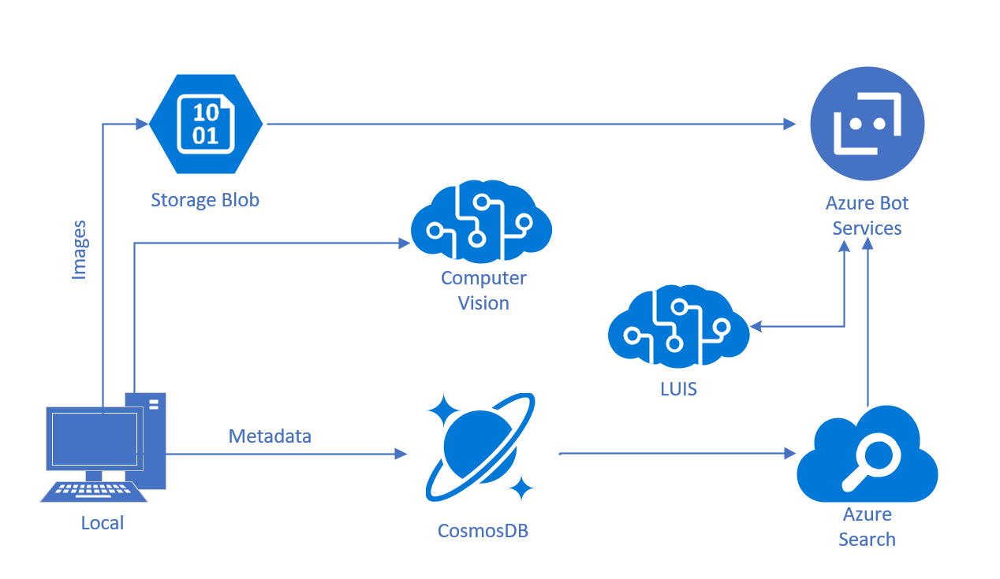

# Lab 1: Meeting the Technical Requirements

## Lab 1.1: Setting technology, environments and keys

This lab is meant for an Artificial Intelligence (AI) Engineer or an AI Developer on Azure. To ensure you have time to work through the exercises, there are certain requirements to meet before starting the labs for this course.

You should ideally have some previous exposure to Visual Studio. We will be using it for everything we are building in the labs, so you should be familiar with [how to use it](https://docs.microsoft.com/en-us/visualstudio/ide/visual-studio-ide) to create applications. Additionally, this is not a class where we teach code or development. We assume you have some familiarity with C# (intermediate level - you can learn [here](https://mva.microsoft.com/en-us/training-courses/c-fundamentals-for-absolute-beginners-16169?l=Lvld4EQIC_2706218949) and [here](https://docs.microsoft.com/en-us/dotnet/csharp/quick-starts/)), but you do not know how to implement solutions with Cognitive Services.

### Account Setup

> Note: You can use different environments for completing this lab.  Your instructor will guide you through the necessary steps to get the environment up and running.   This could be as simple as using the computer you are logged into in the classroom or as complex as setting up a virtualized environment.  The labs were created and tested using the Azure Data Science Virtual Machine (DSVM) on Azure and as such, will require an Azure account to use.

#### Setup your Azure Account:

You may activate an Azure free trial at [https://azure.microsoft.com/en-us/free/](https://azure.microsoft.com/en-us/free/).

If you have been given an Azure Pass to complete this lab, you may go to [http://www.microsoftazurepass.com/](http://www.microsoftazurepass.com/) to activate it.  Please follow the instructions at [https://www.microsoftazurepass.com/howto](https://www.microsoftazurepass.com/howto), which document the activation process.  A Microsoft account may have **one free trial** on Azure and one Azure Pass associated with it, so if you have already activated an Azure Pass on your Microsoft account, you will need to use the free trial or use another Microsoft account.

### Environment Setup

These labs are intended to be used with the .NET Framework using [Visual Studio 2017, Community Edition](https://www.visualstudio.com/downloads/).  The original workshop was designed to be used, and was tested with, the Azure Data Science Virtual Machine (DSVM).  Only premium Azure subscriptions can actually create a DSVM resource on Azure but the labs can be completed with a local computer running Visual Studio 2017 Community Edition and the required software downloads listed throughout the lab steps.

### Key Setup

Over the course of this lab, we will collect a variety of Cognitive Services keys and storage keys. You should save all of them in a text file so you can easily access them in future labs.

>_Keys_
>
>- Cognitive Services Training key:
>- Cognitive Services API key:
>- LUIS API endpoint, key, app ID:
>- Bot App Name:
>- Bot App ID:
>- Bot App Password:

### Bot Builder SDK

We will use the Bot Builder template for C# to create bots in this course.

#### Download the Bot Builder SDK

Download the [Bot Builder SDK v4 Template for C# here](https://marketplace.visualstudio.com/items?itemName=BotBuilder.botbuilderv4) and click "Save as" to save it to your lab folder. If the package has ".zip" extension, rename it to ".vsix" extension. Then double-click on the package to start installation.

### Bot Emulator

We will be developing a bot using the latest .NET SDK (v4).  To get started, we'll need to download the Bot Framework Emulator, and we'll need to create a Web App Bot and get the source code.

##### Download the Bot Framework Emulator

You can download the v4 Preview Bot Framework Emulator for testing your bot locally. The instructions for the rest of the labs will assume you've downloaded the v4 Emulator (as opposed to the v3 Emulator). Download the emulator by going to [this page](https://github.com/Microsoft/BotFramework-Emulator/releases) and downloading the most recent version of the emulator that has the tag "4.1.0" (select the ".exe" file, if you are using windows).

## Lab 1.2: Architectural overview

We will build a simple C# application that allows you to ingest pictures from your local drive, then invoke the [Computer Vision API](https://www.microsoft.com/cognitive-services/en-us/computer-vision-api) to analyze the images and obtain tags and a description.

In the continuation of this lab throughout the lab, we'll show you how to build a [Bot Framework](https://dev.botframework.com/) bot to interact with customers' text inquiries. We will then demonstrate a quick solution for integrating existing Knowledge Bases and FAQs into a bot framework with the [QnA Maker](https://docs.microsoft.com/en-us/azure/cognitive-services/qnamaker/overview/overview). Finally, we'll extend this bot with [LUIS](https://www.microsoft.com/cognitive-services/en-us/language-understanding-intelligent-service-luis) to automatically derive intent from your queries and use those to respond to your customers' text requests intelligently.

We will only provide context for using Bing Search to enable customers to access other data during interactions with the bot, but will not implement these scenarios during the lab. Participants are invited to read further about the [Bing Web Search](https://azure.microsoft.com/en-us/services/cognitive-services/directory/search/) services.

While out of scope for this lab, this architecture integrates Azure's data solutions manage storage of images and metadata in this architecture, through [Blob Storage]((https://docs.microsoft.com/en-us/azure/storage/storage-dotnet-how-to-use-blobs)) and [Cosmos DB](https://azure.microsoft.com/en-us/services/cosmos-db/).

## Lab 1.3: Resources for future projects/learning

To deepen your understanding of the architecture described here, and to involve your broader team in the development of AI solutions, we recommend reviewing the following resources:

- [Cognitive Services](https://www.microsoft.com/cognitive-services) - AI Engineer
- [Cosmos DB](https://docs.microsoft.com/en-us/azure/cosmos-db/) - Data Engineer
- [Azure Search](https://azure.microsoft.com/en-us/services/search/) - Search Engineer
- [Bot Developer Portal](http://dev.botframework.com) - AI Engineer

## Credits

Labs in this series were adapted from the [Cognitive Services Tutorial](https://github.com/noodlefrenzy/CognitiveServicesTutorial) and [Learn AI Bootcamp](https://github.com/Azure/LearnAI-Bootcamp)
