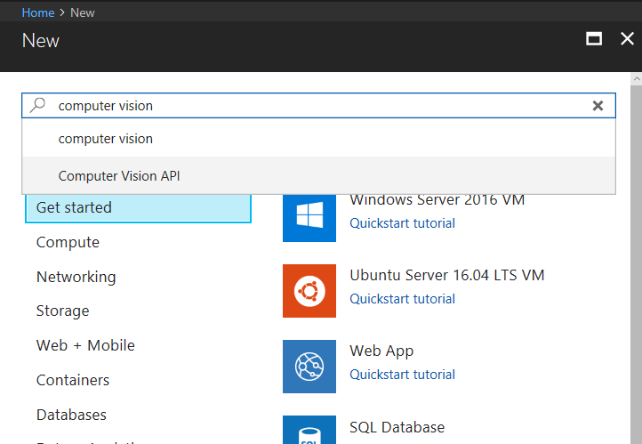
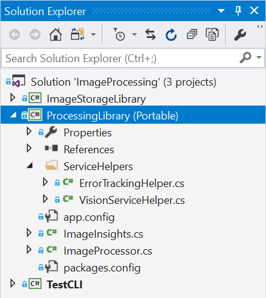

# Lab 2 - Implement Computer Vision

## Lab 2.0: Objectives

In this lab, you will:

- Learn about the various Cognitive Services APIs
- Understand how to configure your apps to call Cognitive Services
- Build an application that calls various Cognitive Services APIs (specifically Computer Vision) in .NET applications

While there is a focus on Cognitive Services, you will also leverage Visual Studio 2017, Community Edition.

> Note: if you have not already, follow the directions for creating your Azure account, Cognitive Services, and getting your Computer Vision keys in [Lab1-Technical_Requirements.md](../Lab1-Technical_Requirements/02-Technical_Requirements.md).

## Introduction

We're going to build an end-to-end application that allows you to pull in your own pictures, use Cognitive Services to obtain a caption and some tags about the images. In later labs, we will build a Bot Framework bot using LUIS to allow easy, targeted querying of such images.

## Lab 2.1: Architecture

We will build a simple C# application that allows you to ingest pictures from your local drive, then invoke the [Computer Vision API](https://www.microsoft.com/cognitive-services/en-us/computer-vision-api) to analyze the images and obtain tags and a description.

In the continuation of this lab throughout the course, we'll show you how to query your data, and then build a [Bot Framework](https://dev.botframework.com/) bot to query it. Finally, we'll extend this bot with [LUIS](https://www.microsoft.com/cognitive-services/en-us/language-understanding-intelligent-service-luis) to automatically derive intent from your queries and use those to direct your searches intelligently.


> This lab was modified from this [Cognitive Services Tutorial](https://github.com/noodlefrenzy/CognitiveServicesTutorial).

## Lab 2.2: Resources

There are two directories in the [main](./) course folder:

- **code**: In here, there are several directories that we will use:
  - **Starting-ImageProcessing** and **Finished-ImageProcessing**: There is a folder for starting, which you should use if you are going through the labs, but there is also a finished folder if you get stuck or run out of time. Each folder contains a solution (.sln) that has several different projects for the lab, let's take a high level look at them:
    - **ProcessingLibrary**: This is a Portable Class Library (PCL) containing helper classes for accessing the various Cognitive Services related to Vision, and some "Insights" classes for encapsulating the results..

- **sample_images**: Some sample images to use in testing your implementation of Cognitive Services.

### Getting Started

Follow the directions for creating your Azure account, Cognitive Services, and getting your Computer Vision keys in [Lab1-Technical_Requirements.md](../Lab1-Technical_Requirements/02-Technical_Requirements.md).

Over the course of this lab, we will collect Cognitive Services keys and storage keys. You should save all of them in a text file so you can easily access them in future labs.

**Getting Cognitive Services API Keys**

Within the Portal, we'll first create keys for the Cognitive Services we'll be using. We'll primarily be using the [Computer Vision](https://www.microsoft.com/cognitive-services/en-us/computer-vision-api) Cognitive Service, so let's create an API key for that first.

In the Portal, click the **"+ New"** button (when you hover over it, it will say **Create a resource**) and then enter **computer vision** in the search box and choose **Computer Vision API**:



This will lead you to fill out a few details for the API endpoint you'll be creating, choosing the API you're interested in and where you'd like your endpoint to reside (**!!put in the West US region or it will not work!!**), as well as what pricing plan you'd like. We'll be using **S1** so that we have the throughput we need for the tutorial. _Pin to dashboard_ so that you can easily find it. Since the Computer Vision API stores images internally at Microsoft (in a secure fashion), to help improve future Cognitive Services Vision offerings, you'll need to check the box that states you're ok with this before you can create the resource.

**Double check that you put your Computer Vision service in West US**

> The code in the following labs has been set up to use West US for calling the Computer Vision API. In your future endeavors, you can learn how to call other regions [here](https://docs.microsoft.com/en-us/azure/cognitive-services/Computer-vision/Vision-API-How-to-Topics/HowToSubscribe).


>Note: there are two keys for each of the Cognitive Services APIs you will create. Either one will work. You can read more about multiple keys [here](https://blogs.msdn.microsoft.com/mast/2013/11/06/why-does-an-azure-storage-account-have-two-access-keys/).

## Lab 2.3: Create and configure a storage account.

1. In the Azure portal, navigate to the **+ Create** a resource blade.
2. In the New blade, navigate to the Search the Marketplace text box, and type the word storage. Click **Storage account** in the list that appears.
3. In the Storage account blade, click Create.
4. From the Create storage account blade, create the first storage account with the following settings:
    - Resource group name: group you created previously for Cognitive Service.
    - Subscription: the name of the subscription you are using in this lab.
    - Storage account name: **imgsourcexx**, where xx are your initials.
    - Location: *West US*.
    - Performance: *Standard*.
    - Account kind: *StorageV2* (general purpose v2).
5. In the Create storage account blade, click **Review + create**.
6. After the validation of the Create storage account blade, click **Create**.

>Note: The creation of the storage account will take approximately 90 seconds while it provisions the disks and the configuration of the disks as per the settings you have defined.

## Lab 2.4: Obtain Storage account connection sting.

1. In the Azure portal, in the **imgsourcexx** - screen, click on "Access keys* item in the list.
2. Copy in the text file you created in Lab 1 following values:
    - Storage Account Name
    - Key (from Key1)
    - Connection string (from Key1)
3. Paste values and save the text file.

## Lab 2.5: Create an Azure Cosmos DB instance

1. In the Azure portal, navigate to the **+ Create** a resource blade.
2. In the New blade, navigate to the Search the Marketplace text box, and type the word *Cosmos*. Click Azure Cosmos DB in the list that appears.
3. In the Azure Cosmos DB blade, click Create.
4. From the Create Azure Cosmos DB Account screen, create an Azure Cosmos DB Account with the following settings:
    - Subscription: the name of the subscription you are using in this lab
    - Resource group name: the name of the subscription you are using in this lab.
    - Account name: **imgmetaxx**, where xx are your initials.
    - API: *Core(SQL)*
    - Location: *West US*.
5. In the Create Azure Cosmos DB Account blade, click **Review + create**.
6. After the validation of the Create Azure Cosmos DB Account blade, click *Create*.

> Note: The provision will take approximately 10 minutes.

7. When the provisioning is complete, the "Your deployment is complete" screen appears, click on Go to resource and move onto the next exercise.

## Lab 2.6: Obtain Cosmos DB account connection string.

1. In the Azure portal, in the **imgmetaxx** - screen, click on "Keys* item in the list.
2. Copy in the text file you created in Lab 1 following values:
    - URI
    - PRIMARY KEY
3. Paste values and save the text file.

## Lab 2.7: Image Processing

## Cognitive Services

Cognitive Services can be used to infuse your apps, websites and bots with algorithms to see, hear, speak, understand, and interpret your user needs through natural methods of communication.

There are five main categories for the available Cognitive Services:
- **Vision**: Image-processing algorithms to identify, caption and moderate your pictures
- **Knowledge**: Map complex information and data in order to solve tasks such as intelligent recommendations and semantic search
- **Language**: Allow your apps to process natural language with pre-built scripts, evaluate sentiment and learn how to recognize what users want
- **Speech**: Convert spoken audio into text, use voice for verification, or add speaker recognition to your app
- **Search**: Add Bing Search APIs to your apps and harness the ability to comb billions of webpages, images, videos, and news with a single API call

You can browse all of the specific APIs in the [Services Directory](https://azure.microsoft.com/en-us/services/cognitive-services/directory/).

As you may recall, the application we'll be building today will use [Computer Vision](https://www.microsoft.com/cognitive-services/en-us/computer-vision-api) to grab tags and a description.

Let's talk about how we're going to call Cognitive Services in our application.

### **Image Processing Library** ###

Within your solution, under `code/Starting-ImageProcessing`, you'll find the `Processing Library`. This is a [Portable Class Library (PCL)](https://docs.microsoft.com/en-us/dotnet/standard/cross-platform/cross-platform-development-with-the-portable-class-library), which helps in building cross-platform apps and libraries quickly and easily. It serves as a wrapper around several services. This specific PCL contains some helper classes (in the ServiceHelpers folder) for accessing the Computer Vision API and an "ImageInsights" class to encapsulate the results. Later, we'll create an image processor class that will be responsible for wrapping an image and exposing several methods and properties that act as a bridge to the Cognitive Services.



After creating the image processor (in Lab 2.4), you should be able to pick up this portable class library and drop it in your other projects that involve Cognitive Services (some modification will be required depending on which Cognitive Services you want to use).


**ProcessingLibrary: Service Helpers**

Service helpers can be used to make your life easier when you're developing your app. One of the key things that service helpers do is provide the ability to detect when the API calls return a call-rate-exceeded error and automatically retry the call (after some delay). They also help with bringing in methods, handling exceptions, and handling the keys.

You can find additional service helpers for some of the other Cognitive Services within the [Intelligent Kiosk sample application](https://github.com/Microsoft/Cognitive-Samples-IntelligentKiosk/tree/master/Kiosk/ServiceHelpers). Utilizing these resources makes it easy to add and remove the service helpers in your future projects as needed.


**ProcessingLibrary: The "ImageInsights" class**

Take a look at the "ImageInsights" class. You can see that we're calling for `Caption` and `Tags` from the images, as well as a unique `ImageId`. "ImageInsights" pieces only the information we want together from the Computer Vision API (or from Cognitive Services, if we choose to call multiple).

Now let's take a step back for a minute. It isn't quite as simple as creating the "ImageInsights" class and copying over some methods/error handling from service helpers. We still have to call the API and process the images somewhere. For the purpose of this lab, we are going to walk through creating `ImageProcessor.cs`, but in future projects, feel free to add this class to your PCL and start from there (it will need modification depending what Cognitive Services you are calling and what you are processing - images, text, voice, etc.).

## Lab 2.8: Creating `ImageProcessor.cs`

If you haven't already, navigate to `code/Starting-ImageProcessing`, where you'll find the `Processing Library`.

Right-click on the solution and select "Build Solution". The solution might not be compiled because it refer to method `ProcessImageAsync` in `ImageProcessor` class. The method will be implemented on next step.

Navigate to `ImageProcessor.cs` within `ProcessingLibrary`.

**Step 1**: Add the following [`using` directives](https://docs.microsoft.com/en-us/dotnet/csharp/language-reference/keywords/using-directive) **to the top** of the class, above the namespace:

```csharp
using System;
using System.IO;
using System.Linq;
using System.Threading.Tasks;
using Microsoft.ProjectOxford.Vision;
using ServiceHelpers;
```

[Project Oxford](https://blogs.technet.microsoft.com/machinelearning/tag/project-oxford/) was the project where many Cognitive Services got their start. As you can see, the NuGet Packages were even labeled under Project Oxford. In this scenario, we'll call `Microsoft.ProjectOxford.Vision` for the Computer Vision API. Additionally, we'll reference our service helpers (remember, these will make our lives easier). You'll have to reference different packages depending on which Cognitive Services you're leveraging in your application.

**Step 2**: In `ImageProcessor.cs` we will start by creating a method we will use to process the image, `ProcessImageAsync`. Paste the following code within the `ImageProcessor` class (between the `{ }`):

```csharp
public static async Task<ImageInsights> ProcessImageAsync(Func<Task<Stream>> imageStreamCallback, string imageId)
        {

        }
```

In the above code, we use `Func<Task<Stream>>` because we want to make sure we can process the image multiple times (once for each service that needs it), so we have a Func that can hand us back a way to get the stream. Since getting a stream is usually an async operation, rather than the Func handing back the stream itself, it hands back a task that allows us to do so in an async fashion.

**Step 3**: In `ImageProcessor.cs`, within the `ProcessImageAsync` method, we're going to set up a [static array](https://stackoverflow.com/questions/4594850/definition-of-static-arrays) that we'll fill in throughout the processor. As you can see, these are the main attributes we want to call for `ImageInsights.cs`. Add the code below between the `{ }` of `ProcessImageAsync`:

```csharp
VisualFeature[] DefaultVisualFeaturesList = new VisualFeature[] { VisualFeature.Tags, VisualFeature.Description };
```

**Step 4**: Next, we want to call the Cognitive Service (specifically Computer Vision) and put the results in `imageAnalysisResult`. Use the code below to call the Computer Vision API (with the help of `VisionServiceHelper.cs`) and store the results in `imageAnalysisResult`. Near the bottom of `VisionServiceHelper.cs`, you will want to review the available methods for you to call (`RunTaskWithAutoRetryOnQuotaLimitExceededError`, `DescribeAsync`, `AnalyzeImageAsync`, `RecognizeTextAsyncYou`). You will use the AnalyzeImageAsync method in order to return the visual features.

```csharp
var imageAnalysisResult = await VisionServiceHelper.AnalyzeImageAsync(imageStreamCallback, DefaultVisualFeaturesList);
```

**Step 5**: Now that we've called the Computer Vision service, we want to create an entry in "ImageInsights" with only the following results: ImageId, Caption, and Tags (you can confirm this by revisiting `ImageInsights.cs`). Paste the following code below `var imageAnalysisResult` and  fill in the code for `ImageId`, `Caption`, and `Tags`:


```csharp
            ImageInsights result = new ImageInsights
            {
                ImageId = imageId,
                Caption = imageAnalysisResult.Description.Captions[0].Text,
                Tags = imageAnalysisResult.Tags.Select(t => t.Name).ToArray()
            };
```


So now we have the caption and tags that we need from the Computer Vision API, and each image's result (with imageId) is stored in "ImageInsights".

**Step 6**: Lastly, we need to close out the method by adding the following line to the end of the method:

```csharp
return result;
```

Now that you've built `ImageProcessor.cs`, don't forget to save it!

Want to make sure you set up `ImageProcessor.cs` correctly? You can find the full class [here](./code/Finished-ImageProcessing/ProcessingLibrary/ImageProcessor.cs).

## Lab 2.9 TestCLI

### Exploring Cosmos DB

Azure Cosmos DB is Microsoft's resilient NoSQL PaaS solution and is incredibly useful for storing loosely structured data like we have with our image metadata results. There are other possible choices (Azure Table Storage, SQL Server), but Cosmos DB gives us the flexibility to evolve our schema freely (like adding data for new services), query it easily, and can be quickly integrated into Azure Search (which we'll do in a later lab).

## Lab 2.10: Understanding CosmosDBHelper

Cosmos DB is not a focus of this lab, but if you're interested in what's going on - here are some highlights from the code we will be using:

- Navigate to the `CosmosDBHelper.cs` class in the `ImageStorageLibrary`. Review the code and the comments. Many of the implementations used can be found in the [Getting Started guide](https://docs.microsoft.com/en-us/azure/cosmos-db/documentdb-get-started).
- Go to `TestCLI`'s `Util.cs` and review  the `ImageMetadata` class (code and comments). This is where we turn the `ImageInsights` we retrieve from Cognitive Services into appropriate Metadata to be stored into Cosmos DB.
- Finally, look in `Program.cs` in `TestCLI` and at  `ProcessDirectoryAsync`. First, we check if the image and metadata have already been uploaded - we can use `CosmosDBHelper` to find the document by ID and to return `null` if the document doesn't exist. Next, if we've set `forceUpdate` or the image hasn't been processed before, we'll call the Cognitive Services using `ImageProcessor` from the `ProcessingLibrary` and retrieve the `ImageInsights`, which we add to our current `ImageMetadata`.  

Once all of that is complete, we can store our image - first the actual image into Blob Storage using our `BlobStorageHelper` instance, and then the `ImageMetadata` into Cosmos DB using our `CosmosDBHelper` instance. If the document already existed (based on our previous check), we should update the existing document. Otherwise, we should be creating a new one.

### Lab 2.11: Loading Images using TestCLI

We will implement the main processing and storage code as a command-line/console application because this allows you to concentrate on the processing code without having to worry about event loops, forms, or any other UX related distractions. Feel free to add your own UX later.

Once you've set your Cognitive Services API keys, your Azure Blob Storage Connection String, and your Cosmos DB Endpoint URI and Key in your _TestCLI's_ `settings.json`, you can run the _TestCLI_. The values should be stored in your text file created on Lab 1. Copy values accordantly in the `settings.json`

Run _TestCLI_, then open Command Prompt and navigate to Debug folder for your application for this lab. Then enter `TestCLI.exe`. You should get the following result:

```
    > TestCLI.exe

    Usage:  [options]

    Options:
    -force            Use to force update even if file has already been added.
    -settings         The settings file (optional, will use embedded resource settings.json if not set)
    -process          The directory to process
    -query            The query to run
    -? | -h | --help  Show help information
```

By default, it will load your settings from `settings.json` (it builds it into the `.exe`), but you can provide your own using the `-settings` flag. To load images (and their metadata from Cognitive Services) into your cloud storage, you can just tell _TestCLI_ to `-process` your image directory as follows:

>Replace the <%GitHubDir%> value with the folder where you cloned the repository.

```
    > TestCLI.exe -process <%GitHubDir%>\AI-100-Design-Implement-Azure-AISol\Lab2-Implement_Computer_Vision\sample_images
```

The console should not return any error and processing image should be as following:

```
Processing C:\... \sample_images\Thumbnail_8.jpg
Insights: {"ImageId":"Thumbnail_8.jpg","Caption":"a woman smiling next to a body of water","Tags":["sky","person","outdoor","human face","smile","water","clothing","woman","fashion accessory","pretty","necklace","brassiere","surfer hair","brown hair","blond","girl","long hair","beauty","swimwear"]}
```

Once it's done processing, you can query against your Cosmos DB directly using _TestCLI_ as follows:

```
    > TestCLI.exe -query "select * from images"
```

The console should return following output:

```
{"id":"Thumbnail_8.jpg","BlobUri":"https://imgsourceai.blob.core.windows.net:443/images/Thumbnail_8.jpg","LocalFilePath":"D:\\MOC\\AI100\\Done\\Labs2\\sample_images\\Thumbnail_8.jpg","FileName":"Thumbnail_8.jpg","Caption":"a woman smiling next to a body of water","Tags":["sky","person","outdoor","human face","smile","water","clothing","woman","fashion accessory","pretty","necklace","brassiere","surfer hair","brown hair","blond","girl","long hair","beauty","swimwear"]}
```

Take some time to look through the sample images (you can find them in `/sample_images`) and compare the images to the results in your application (fields as `Caption` and `Tags`).
