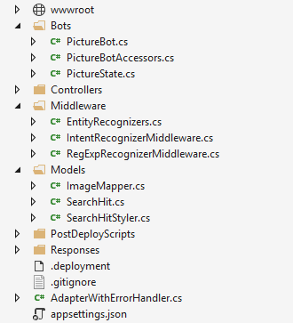

# Lab 3: Creating a Basic filtering bot

## Lab 3.0 A thought before starting

Every new technology brings with it as many opportunities as questions, and AI-powered technology has its own unique considerations.
Be mindful of the following AI Ethics principles when designing and implementing your AI tools:

1. *Fairness*: Maximize efficiencies without destroying dignity
1. *Accountability*: AI must be accountable for its algorithm
1. *Transparency*: Guard against bias and destruction of human dignity
1. *Ethical Application*: AI must assist humanity and be designed for intelligent privacy

We encourage you to [Read more](https://ai-ethics.azurewebsites.net/) about the Ethical considerations when building intelligent apps.

## Lab 3.1: Setting up for bot development

We will be developing a bot using the latest .NET SDK (v4). To get started, we'll need to download the Bot Framework Emulator, and we'll need to create a Web App Bot and get the source code.

Follow the directions for downloading the v4 SDK in the  [Lab1-Technical_Requirements.md](../Lab1-Technical_Requirements/02-Technical_Requirements.md).


#### Download the Bot Framework Emulator

Follow the directions provided in [Lab1-Technical_Requirements.md](../Lab1-Technical_Requirements/02-Technical_Requirements.md) to download the v4 Preview Bot Framework Emulator to enable you to test your bot locally.

## Create an Azure Web App Bot

A bot created using the Microsoft Bot Framework can be hosted at any publicly-accessible URL.  For the purposes of this lab, we will register our bot using [Azure Bot Service](https://docs.microsoft.com/en-us/bot-framework/bot-service-overview-introduction).

1. Navigate to the portal. In the portal, click **+ Create a resource** and search for "bot". Select **Web App Bot**, and click **Create**.
2. For the name, you'll have to create a unique identifier. We recommend using something along the lines of **PictureBotxxN** where `xx` is your initials and `N` is a number (e.g. mine would be PictureBotamt6).
3. Select in the region: *West US*.
4. For pricing tier, select **F0**, as that is all we will need for this lab.
5. Select a Bot template of **SDK v4** for **Echo Bot** in **C#**, we will update this code to be our PictureBot.
6. Configure a new *App service plan* (put it in the same location as your bot).
7. You can choose to turn *Application Insights* on or off.
8. **Do not** change or click on "Auto create App ID and password", we will get to that later. Click create.


When it's deployed, go to the Web App Resource. You have just deployed a very simple EchoBot with the Echo Bot template. If you wish, you can select the "Test in WebChat" tab once it's deployed, and see what it is capable of doing.

Since this isn't the entirety of the bot we set out to build, the next thing you need to do is download the source code. We'll edit this throughout the next few labs, and then we'll publish it back to this service.

Navigate to the **Build** tab within the portal, and select **Download Bot source code**. Save it somewhere convenient and extract all the files from the zip file.

While you've got the Azure portal open, now is also a good time to find and save the `MicrosoftAppId` and `MicrosoftAppPassword` located in **Configuration > Application Settings** section of your Web App Bot service.

> For future bot-building ventures, you can either start by creating a bot in the portal and downloading the source code (which is what we're doing here), or you can use the Bot Builder template, and we've provided instructions on how to do that: [Lab1-Technical_Requirements.md](../Lab1-Technical_Requirements/02-Technical_Requirements.md)

## Lab 3.2: Creating a simple bot and running it

>Note: In this lab, we will setup code and logic for our bot. You may see some topics in the code (e.g. LUIS) that apply to lessons not yet covered: we will address this functionality in subsequent lessons.

Navigate to the solution file for the Web App Bot you just created, and open it in Visual Studio (in future bots, you can use Visual Studio Code, but for the purposes of these labs, you should use Visual Studio). Spend some time looking at all of the different things you get built in from the Echo Bot template. We won't spend time explaining every single file, but we **highly recommend** spending some time **later** working through and reviewing this sample (and the other Web App Bot sample - Basic Bot), if you have not already. It contains important and useful shells needed for bot development. You can find it and other useful shells and samples [here](https://github.com/Microsoft/BotBuilder-Samples).

For the purposes of this lab, we will modify aspects of the template to fit our needs, which is what you would likely do in the real world as well.

Start by right-clicking on the Solution and selecting **Build**, not build.cmd file. This will load up the packages.

Next, in the `appsettings.json` file, check if it to include the following, from your bot service information as well:

```json
{
  "MicrosoftAppId": "YourMicrosoftAppId",
  "MicrosoftAppPassword": "YourMicrosoftAppPassword",
  "ScmType": "None"
}
```

>Important: you will need to update this information if switching to a different Bot Service

Next, we'll focus on the NuGet packages we need. Right-click on the solution in Solution Explorer and select "Manage NuGet Packages for Solution."

#### Do not update Microsoft.AspNetCore.All or Microsoft.AspNetCore - Start

In the "Installed" tab, update the following packages **in order** to `4.5.1` (this may already be done):

>NOTE: This lab has not been tested with versions newer than 4.5.1

Next, click the "Browse" tab, and install all of the packages listed below. Make sure you check the box "Include prerelease" and are on the "Browse" tab:

* Microsoft.AzureKeyVault.Core(use the latest version)
* Microsoft.Azure.Search (use the latest version)

>NOTE: Ensure that you are using version **4.5.1** where available for following packages:

* Microsoft.Bot.Builder.Azure
* Microsoft.Bot.Builder.AI.Luis
* Microsoft.Bot.Builder.Dialogs

After you've installed them, under **Dependencies > NuGet** in your Solution Explorer, you should see the following packages:

```csharp
* Microsoft.AspNetCore
* Microsoft.Azure.Search
* Microsoft.Azure.KeyVault.Core
* Microsoft.Bot.Builder.AI.Luis
* Microsoft.Bot.Builder.Azure
* Microsoft.Bot.Builder.Dialogs
* Microsoft.Bot.Builder.Integration.AspNet.Core
```

As you probably know, renaming a Visual Studio Solution/Project is a very sensitive task. **Carefully** complete the following tasks so all the names reflect *PictureBot* instead of *EchoBot*. The same changes need to be done on Project properties. Assembly Name and Default Namespace should be renamed to *PictureBot*.

> Note: Renaming files in Visual Studio can take up to 15 seconds while all the references are being resolved. If time is not given for this to occur, the build will fail which may require you to manually resolve the refactored objects. Have patience.

1. Rename the solution and then the project from **EchoBot** to **PictureBot**. Close and reopen Visual Studio.

1. Open wwwroot > default.htm, and replace the occurrences of "Echo bot with counter sample" and **EchoBot** to **PictureBot**.

1. Rename `EchoBotAccessors.cs` to `PictureBotAccessors.cs`
1. Rename `EchoWithCounterBot.cs` to `PictureBot.cs`
1. Rename `EchoBotWithCounter.deps.json` to `PictureBot.deps.json`
1. Rename `EchoBotWithCounter.runtimeconfig.json` to `PictureBot.runtimeconfig.json`
1. Build the solution.

>**TIP**:  If you only have one monitor and you would like to easily switch between instructions and Visual Studio, you can now add the instruction files to your Visual Studio solution by right-clicking on the project in Solution Explorer and selecting **Add > Existing Item**. Navigate to "Lab2," and add all the files of type "MD File."

#### Creating a Hello World bot

So now that we've updated our base shell to support the naming and NuGet packages we'll use throughout the rest of the labs, we're ready to start adding some custom code. First, we'll just create a simple "Hello world" bot that helps you get warmed up to building bots with the V4 SDK.

An important concept is the "turn", used to describe a message to a user and a response from the bot.
For example, if I say "Hello bot" and the bot responds "Hi, how are you?" that is **one** turn. Check in the image below how a **turn** goes through the multiple layers of a bot application.


For the purposes of this section of the lab, navigate to the ConfigureServices method in `Startup.cs` and comment out (using `//`) the line `CounterState = conversationState.CreateProperty<CounterState>(PictureBotAccessors.CounterStateName),`. We'll talk about state and accessors in future sections.

The only other file we need to update to get "Hello world" working is "PictureBot.cs". Open the file and review the comments.

Once you feel semi-comfortable with the code and comments, add the `OnTurnAsync` method with the code below.
This method is called every turn of the conversation. You'll see later why that fact is important, but for now, remember that OnTurnAsync is called on every turn.

```csharp
        /// <summary>
        /// Every conversation turn for our PictureBot will call this method.
        /// There are no dialogs used, since it's "single turn" processing, meaning a single
        /// request and response. Later, when we add Dialogs, we'll have to navigate through this method.
        /// </summary>
        /// <param name="turnContext">A <see cref="ITurnContext"/> containing all the data needed
        /// for processing this conversation turn. </param>
        /// <param name="cancellationToken">(Optional) A <see cref="CancellationToken"/> that can be used by other objects
        /// or threads to receive notice of cancellation.</param>
        /// <returns>A <see cref="Task"/> that represents the work queued to execute.</returns>
        /// <seealso cref="BotStateSet"/>
        /// <seealso cref="ConversationState"/>
        /// <seealso cref="IMiddleware"/>
        public override async Task OnTurnAsync(ITurnContext turnContext, CancellationToken cancellationToken = default(CancellationToken))
        {
            // If the user sends us a message
            if (turnContext.Activity.Type is "message")
            {
                {
                    await turnContext.SendActivityAsync($"Hello world.");
                }
            }
        }
```

Now start your bot (with or without debugging) by pressing the button that looks like a play button, it should say "PictureBot" (or by hitting F5 on your keyboard). NuGet should take care of downloading the appropriate dependencies. You may hit some break points, **remove them** and select "Continue" (by the play button).

A few things to note:

* Your default.htm (under wwwroot) page will be displayed in a browser
* Note the localhost port number for the web page. This should (and must) match the endpoint in your Emulator.
* You'll also see a console window, which, if you were using Visual Studio Code, would just be the Output in the terminal after you submit `dotnet run`. You can ignore this for the purposes of these labs.

>Get stuck or broken? You can find the solution for the lab up until this point under [resources/code/FinishedPictureBot-Part0](./code/FinishedPictureBot-Part0). The readme file within the solution (once you open it) will tell you what keys you need to add in order to run the solution.

#### Using the Bot Framework Emulator

To interact with your bot:

* Launch the Bot Framework Emulator (note we are using the v4 Emulator).  Click **Start**, then search for **Bot Emulator**.

* On the welcome page, click **Create a new bot configuration**

*  For the name, type **PictureBot**

*  Enter the url that is displayed on your bot web page and add `/api/messages` to the end of url

*  Enter the AppId and the App Secret your entered into the `appsettings.json`

>**Note** If you do not enter id and secret values into the bot settings you would also not need to enter the values in the bot emulator

*  Click **Save and connect**, then save your .bot file locally

* You should now be able to converse with the bot.

* Type **hello**. The bot will respond with echoing your message.

> **Note** You can select "Restart conversation" to clear the conversation history.


You can read more about using the Emulator [here](https://docs.microsoft.com/en-us/azure/bot-service/bot-service-debug-emulator?view=azure-bot-service-4.0).
> Aside: Your bot now working on the locally hosted web site with specific port number. Why this port number?  It is set in your project properties.  In your Solution Explorer, double-click **Properties>Debug** and examine its contents. Does the App URL match what you connected to in the emulator?

Browse around and examine the sample bot code. In particular, note:

* **Startup.cs** is where we will add services/middleware and configure the HTTP request pipeline. There are many comments within to help you understand what is happening. Spend a few minutes reading through.

* In **PictureBot.cs**, `OnTurnAsync` is the entry point which waits for a message from the user, and `turnContext.Activity.Type is "message"` is where we can react to a message once received and wait for further messages.  We can use `turnContext.SendActivityAsync` to send a message from the bot back to the user.

## Lab 3.3:  Managing state and services

Navigate again to the Startup class `Startup.cs`. Review it if you have not already. Then, update the list of `using` statements by adding the following:

```csharp
using System.Text.RegularExpressions;
using Microsoft.Bot.Builder.AI.Luis;
```

We won't use the above just yet, but can you guess when we might?

Focus your attention on the `ConfigureServices` method which is used to add services to the bot. Review the contents carefully, noting what is built in for you.

> A few other notes for a deeper understanding:
>
> * If you're unfamiliar with dependency injection, you can [read more about it here](https://docs.microsoft.com/en-us/aspnet/web-api/overview/advanced/dependency-injection).
> * You can use local memory for this lab and testing purposes. For production, you'll have to implement a way to [manage state data](https://docs.microsoft.com/en-us/azure/bot-service/bot-builder-storage-concept?view=azure-bot-service-4.0). In the big chunk of comments within `ConfigureServices`, there are some tips for this.
> * At the bottom of the method, you may notice we create and register state accessors. Managing state is a key in creating intelligent bots, which you can [read more about here](https://docs.microsoft.com/en-us/azure/bot-service/bot-builder-dialog-state?view=azure-bot-service-4.0).

Now we need to update class `Startup.cs` and add following method to configure our Bot class. You can add following after the `services.AddTransient<IBot, PictureBot>();`:

```csharp
services.AddBot<PictureBot>(options =>
{
    //read appsettings.json
    var secretKey = Configuration.GetSection("MicrosoftAppId")?.Value;
    var botFilePath = Configuration.GetSection("MicrosoftAppPassword")?.Value;

    options.CredentialProvider = new SimpleCredentialProvider(endpointService.AppId, endpointService.AppPassword);

});
```

The code is referenced to `_isProduction` field which is needed to add on top of the class:

```csharp
private bool _isProduction = false;
```

Fortunately, this shell is pretty comprehensive, so we only have to add two items: middleware and custom state accessors.

#### Middleware

Middleware is simply a class or set of classes that sit between the adapter and your bot logic, added to your adapter's middleware collection during initialization. The SDK allows you to write your own middleware or add reusable components of middleware created by others. Every activity coming in or out of your bot flows through your middleware. We'll get deeper into this later in the lab, but for now, it's important to understand that every activity flows through your middleware, because it is located in the `AdapterWithErrorHandler` class that gets called at run time (which runs in between every message being sent by a user and OnTurnAsync).

#### Custom state accessors

Before we talk about the custom state accessors that we need, it's important to back up. Dialogs, which we'll really get into in the next section, are an approach to implementing multi-turn conversation logic, which means they'll need to rely on a persisted state to know where in the conversation the users are. In our dialog-based bot, we'll use a DialogSet to hold the various dialogs. The DialogSet is created with a handle to an object called an "accessor".

In the SDK, an accessor implements the `IStatePropertyAccessor` interface, which basically means it provides the ability to get, set, and delete information regarding state, so we can keep track of which step a user is in a conversation.

For each accessor we create, we have to first give it a property name. For our scenario, we want to keep track of a few things:

1. `PictureState`
    * Have we greeted the user yet?
        * We don't want to greet them more than once, but we want to make sure we greet them at the beginning of a conversation.
    * Is the user currently searching for a specific term? If so, what is it?
        * We need to keep track of if the user has told us what they want to search for, and what it is they want to search for if they have.
2. `DialogState`
    * Is the user currently in the middle of a dialog?
        * This is what we'll use to determine where a user is in a given dialog or conversation flow. If you aren't familiar with dialogs, don't worry, we'll get to that soon.

* `DialogState` is a specific accessor that comes from the `Microsoft.Bot.Builder.Dialogs` library. When a message is sent, the Dialog subsystem will call `CreateContext` on the `DialogSet`. Keeping track of this context requires the `DialogState` accessor specifically to get the appropriate dialog state JSON.
* On the other hand, `PictureState` will be used to track particular conversation properties that we specify throughout the conversation (e.g. Have we greeted the user yet?)

> Don't worry about the dialog jargon yet, but the process should make sense. If you're confused, you can [dive deeper into how state works](https://docs.microsoft.com/en-us/azure/bot-service/bot-builder-dialog-state?view=azure-bot-service-4.0).

## Lab 3.4: Implement start up code for bot

Now back to the project. In the following directory [resources/code/assets](./code/assets) you will find addental files and folders. Those files need to be add to the project:




Open class `Startup.cs` again and add following lines to configure `PictureBotAccessors`. The lines need to be added at the end of `ConfigureServices` method.

```csharp
services.AddSingleton<PictureBotAccessors>(sp =>
{
     var options = sp.GetRequiredService<IOptions<BotFrameworkOptions>>().Value;
     if (options == null)
     {
         throw new InvalidOperationException("BotFrameworkOptions must be configured prior to setting up the state accessors");
     }

         var conversationState = new ConversationState(new MemoryStorage());

        // Create the custom state accessor.
         // State accessors enable other components to read and write individual properties of state.
        var accessors = new PictureBotAccessors(conversationState)
        {
             PictureState = conversationState.CreateProperty<PictureState>(PictureBotAccessors.PictureStateName),
             DialogStateAccessor = conversationState.CreateProperty<DialogState>("DialogState"),
        };
        return accessors;
});
```

After resolving references, the code should be build successful.

## Lab 3.4: Organizing code for bots

There are many different methods and preferences for developing bots. The SDK allows you to organize your code in whatever way you want. In these labs, we'll organize our conversations into different dialogs, and we'll explore a [MVVM style](https://msdn.microsoft.com/en-us/library/hh848246.aspx) of organizing code around conversations.

This PictureBot will be organized in the following way:

* **Dialogs** - the business logic for editing the models
* **Responses** - classes which define the outputs to the users
* **Models** - the objects to be modified

The following folders  "**Responses**" and "**Models**" should be already create within your project.

#### Dialogs

You may already be familiar with Dialogs and how they work. If you aren't, read [this page on Dialogs](https://docs.microsoft.com/en-us/azure/bot-service/bot-builder-dialog-manage-conversation-flow?view=azure-bot-service-4.0&tabs=csharp) before continuing.

When a bot has the ability to perform multiple tasks, it is nice to be able to have multiple dialogs, or a set of dialogs, to help users navigate through different conversation flows. For our PictureBot, we want our users to be able to go through an initial menu flow, often referred to as a main dialog, and then branch off to different dialogs depending what they are trying to do - search pictures, share pictures, order pictures, or get help. We can do this easily by using a dialog container or what's referred to here as a `DialogSet`. Read about [creating modular bot logic and complex dialogs](https://docs.microsoft.com/en-us/azure/bot-service/bot-builder-compositcontrol?view=azure-bot-service-4.0&tabs=csharp) before continuing.

For the purposes of this lab, we are going to keep things fairly simple, but after, you should be able to create a dialog set with many dialogs. For our PictureBot, we'll have two main dialogs:

* **MainDialog** - The default dialog the bot starts out with. This dialog will start other dialog(s) as the user requests them. This dialog, as it is the main dialog for the dialog set, will be responsible for creating the dialog container and redirecting users to other dialogs as needed.
* **SearchDialog** - A dialog which manages processing search requests and returning those results to the user.  *Note: We will evoke this functionality, but will not implement Search in this lab.*

Since we only have two dialogs, we can keep it simple and put them in the `PictureBot` class. However, complex scenarios may require splitting them out into different dialogs in a folder (similar to how we'll separate Responses and Models).

Next, we'll need to update `PictureBot.cs` class. Add following lines to the top of the class to initialize fields.

```csharp
        private readonly PictureBotAccessors _accessors;
        private readonly ILogger _logger;
        private DialogSet _dialogs;
```

Next, add following lines to the bottom of the `PictureBot.cs` class. There are initializing of the bot dialogs.

```csharp
        // Add MainDialog-related tasks
        // If we haven't greeted a user yet, we want to do that first, but for the rest of the
        // conversation we want to remember that we've already greeted them.
        private async Task<DialogTurnResult> GreetingAsync(WaterfallStepContext stepContext, CancellationToken cancellationToken)
        {
            // Get the state for the current step in the conversation
            var state = await _accessors.PictureState.GetAsync(stepContext.Context, () => new PictureState());

            // If we haven't greeted the user
            if (state.Greeted == "not greeted")
            {
                // Greet the user
                await MainResponses.ReplyWithGreeting(stepContext.Context);
                // Update the GreetedState to greeted
                state.Greeted = "greeted";
                // Save the new greeted state into the conversation state
                // This is to ensure in future turns we do not greet the user again
                await _accessors.ConversationState.SaveChangesAsync(stepContext.Context);
                // Ask the user what they want to do next
                await MainResponses.ReplyWithHelp(stepContext.Context);
                // Since we aren't explicitly prompting the user in this step, we'll end the dialog
                // When the user replies, since state is maintained, the else clause will move them
                // to the next waterfall step
                return await stepContext.EndDialogAsync();
            }
            else // We've already greeted the user
            {
                // Move to the next waterfall step, which is MainMenuAsync
                return await stepContext.NextAsync();
            }
        }

        // This step routes the user to different dialogs
        // In this case, there's only one other dialog, so it is more simple,
        // but in more complex scenarios you can go off to other dialogs in a similar
        public async Task<DialogTurnResult> MainMenuAsync(WaterfallStepContext stepContext, CancellationToken cancellationToken)
        {
            // Check if we are currently processing a user's search
            var state = await _accessors.PictureState.GetAsync(stepContext.Context);

            // If Regex picks up on anything, store it
            var recognizedIntents = stepContext.Context.TurnState.Get<IRecognizedIntents>();
            // Based on the recognized intent, direct the conversation
            switch (recognizedIntents.TopIntent?.Name)
            {
                case "search":
                    // switch to the search dialog
                    return await stepContext.BeginDialogAsync("searchDialog", null, cancellationToken);
                case "share":
                    // respond that you're sharing the photo
                    await MainResponses.ReplyWithShareConfirmation(stepContext.Context);
                    return await stepContext.EndDialogAsync();
                case "order":
                    // respond that you're ordering
                    await MainResponses.ReplyWithOrderConfirmation(stepContext.Context);
                    return await stepContext.EndDialogAsync();
                case "help":
                    // show help
                    await MainResponses.ReplyWithHelp(stepContext.Context);
                    return await stepContext.EndDialogAsync();
                default:
                    {
                        await MainResponses.ReplyWithConfused(stepContext.Context);
                        return await stepContext.EndDialogAsync();
                    }
            }
        }
        // Add SearchDialog-related tasks
```

Now add `PictureBot` constructor:

```csharp
/// <summary>
/// Initializes a new instance of the <see cref="PictureBot"/> class.
/// </summary>
/// <param name="accessors">A class containing <see cref="IStatePropertyAccessor{T}"/> used to manage state.</param>
/// <param name="loggerFactory">A <see cref="ILoggerFactory"/> that is hooked to the Azure App Service provider.</param>
/// <seealso cref="https://docs.microsoft.com/en-us/aspnet/core/fundamentals/logging/?view=aspnetcore-2.1#windows-eventlog-provider"/>
public PictureBot(PictureBotAccessors accessors, ILoggerFactory loggerFactory /*, LuisRecognizer recognizer*/)
{
            if (loggerFactory == null)
            {
                throw new System.ArgumentNullException(nameof(loggerFactory));
            }

            // Lab 2.2.3 Add instance of LUIS Recognizer

            _logger = loggerFactory.CreateLogger<PictureBot>();
            _logger.LogTrace("PictureBot turn start.");
            _accessors = accessors ?? throw new System.ArgumentNullException(nameof(accessors));

            // The DialogSet needs a DialogState accessor, it will call it when it has a turn context.
            _dialogs = new DialogSet(_accessors.DialogStateAccessor);

            // This array defines how the Waterfall will execute.
            // We can define the different dialogs and their steps here
            // allowing for overlap as needed. In this case, it's fairly simple
            // but in more complex scenarios, you may want to separate out the different
            // dialogs into different files.
            var main_waterfallsteps = new WaterfallStep[]
            {
                GreetingAsync,
                MainMenuAsync,
            };
            var search_waterfallsteps = new WaterfallStep[]
            {
                // Add SearchDialog water fall steps

            };

            // Add named dialogs to the DialogSet. These names are saved in the dialog state.
            _dialogs.Add(new WaterfallDialog("mainDialog", main_waterfallsteps));
            _dialogs.Add(new WaterfallDialog("searchDialog", search_waterfallsteps));
            // The following line allows us to use a prompt within the dialogs
            _dialogs.Add(new TextPrompt("searchPrompt"));
}
```

Finally update the method `OnTurnAsync` in the bot class.

```csharp
        /// <summary>
        /// Every conversation turn for our PictureBot will call this method.
        /// There are no dialogs used, since it's "single turn" processing, meaning a single
        /// request and response. Later, when we add Dialogs, we'll have to navigate through this method.
        /// </summary>
        /// <param name="turnContext">A <see cref="ITurnContext"/> containing all the data needed
        /// for processing this conversation turn. </param>
        /// <param name="cancellationToken">(Optional) A <see cref="CancellationToken"/> that can be used by other objects
        /// or threads to receive notice of cancellation.</param>
        /// <returns>A <see cref="Task"/> that represents the work queued to execute.</returns>
        /// <seealso cref="BotStateSet"/>
        /// <seealso cref="ConversationState"/>
        /// <seealso cref="IMiddleware"/>
        public override async Task OnTurnAsync(ITurnContext turnContext, 
            CancellationToken cancellationToken = default(CancellationToken))
        {
            // If the user sends us a message
            if (turnContext.Activity.Type is "message")
            {
                // Establish dialog context from the conversation state.
                var dc = await _dialogs.CreateContextAsync(turnContext);
                // Continue any current dialog.
                var results = await dc.ContinueDialogAsync(cancellationToken);

                // Every turn sends a response, so if no response was sent,
                // then there no dialog is currently active.
                if (!turnContext.Responded)
                {
                    // Start the main dialog
                    await dc.BeginDialogAsync("mainDialog", null, cancellationToken);
                }
            }
            await base.OnTurnAsync(turnContext, cancellationToken);
        }
```

After resolving reference your code should be successfully builds.

Spend some time reviewing and discussing this shell with a fellow lab participant. You should understand the purpose of each line before continuing.

#### Responses

So before we fill out our dialogs, we need to have some responses ready. Remember, we're going to keep dialogs and responses separate, because it results in cleaner code, and an easier way to follow the logic of the dialogs. If you don't agree or understand now, you will soon.

Observer class called `MainResponses.cs` within the folder `Responses`. As you may have figured out, the Responses files will simply contain the different outputs we may want to send to users, no logic.

Note that there are two responses with no values (ReplyWithGreeting and ReplyWithConfused). Fill these in as you see fit.

Observer class called `SearchResponses.cs` in the same folder.

#### Models

Due to time limitations, we will not be walking through creating all the models. They are straightforward, but we recommend taking some time to review the code within after you've added them. Open the "Models" folder and observe existed files. It will be used for dialog conversation later.  

### Lab 3.5: Regex and Middleware

There are a number of things that we can do to improve our bot.  First of all, we may not want to call LUIS for a simple "search pictures" message, which the bot will get fairly frequently from its users.  A simple regular expression could match this, and save us time (due to network latency) and money (due to cost of calling the LUIS service).

Also, as the complexity of our bot grows and we are taking the user's input and using multiple services to interpret it, we need a process to manage that flow.  For example, try regular expressions first, and if that doesn't match, call LUIS, and then perhaps we also drop down to try other services like [QnA Maker](http://qnamaker.ai) or Azure Search. A great way to manage this is through [Middleware](https://docs.microsoft.com/en-us/azure/bot-service/bot-builder-concept-middleware?view=azure-bot-service-4.0), and the SDK does a great job supporting that.

Before continuing with the lab, learn more about middleware and the Bot Framework SDK:

1. [Overview and Architecture](https://docs.microsoft.com/en-us/azure/bot-service/bot-builder-basics?view=azure-bot-service-4.0)
1. [Middleware](https://docs.microsoft.com/en-us/azure/bot-service/bot-builder-concept-middleware?view=azure-bot-service-4.0)
1. [Creating Middleware](https://docs.microsoft.com/en-us/azure/bot-service/bot-builder-create-middleware?view=azure-bot-service-4.0&tabs=csaddmiddleware%2Ccsetagoverwrite%2Ccsmiddlewareshortcircuit%2Ccsfallback%2Ccsactivityhandler)

Ultimately, we'll use some middleware to try to understand what users are saying with regular expressions (Regex) first, and if we can't, we'll call LUIS. If we still can't, then we'll drop down to a generic "I'm not sure what you mean" response, or whatever you put for "ReplyWithConfused"

To add the middleware for Regex to your solution, observer the contents of the "Middleware" folder in your solution. **You can also use this middleware in your future projects!**

Now we need to connect middleware to the project. In 'AdapterWithErrorHandler.cs', add the following to the class constructor:

```csharp
            this.MiddlewareSet.Use(new RegExpRecognizerMiddleware()
            .AddIntent("search", new Regex("search picture(?:s)*(.*)|search pic(?:s)*(.*)", RegexOptions.IgnoreCase))
            .AddIntent("share", new Regex("share picture(?:s)*(.*)|share pic(?:s)*(.*)", RegexOptions.IgnoreCase))
            .AddIntent("order", new Regex("order picture(?:s)*(.*)|order print(?:s)*(.*)|order pic(?:s)*(.*)", RegexOptions.IgnoreCase))
            .AddIntent("help", new Regex("help(.*)", RegexOptions.IgnoreCase))
            );
```

> We're really just skimming the surface of using regular expressions. If you're interested, you can [learn more here](https://docs.microsoft.com/en-us/dotnet/standard/base-types/regular-expression-language-quick-reference).

Without adding LUIS, our bot is really only going to pick up on a few variations, but it should capture a good bit of messages, if the users are using the bot for searching and sharing and ordering pictures.

> Aside: One might argue that the user shouldn't have to type "help" to get a menu of clear options on what the bot can do; rather, this should be the default experience on first contact with the bot.  **Discoverability** is one of the biggest challenges for bots - letting the users know what the bot is capable of doing.  Good [bot design principles](https://docs.microsoft.com/en-us/bot-framework/bot-design-principles) can help.

## Lab 3.6: Running the bot

Hit F5 to run the bot. Test it by sending commands like "help", "share pics", "order pics", and "search pics". If the only thing that didn't give you the expected result was "search pics", everything is working how you configured it. "search pics" failing is the expected behavior at this point in the lab, but why? Have an answer before you move on!

>Hint: Use break points to trace matching to case "search", starting from `PictureBot.cs`.

>Get stuck or broken? You can find the solution for the lab up until this point under [resources/code/FinishedPictureBot-Part1](./code/FinishedPictureBot-Part1). The readme file within the solution (once you open it) will tell you what keys you need to add in order to run the solution. We recommend using this as a reference, not as a solution to run, but if you choose to run it, be sure to add the necessary keys (in this section, there should only be the Bot Service secrets).

 ### Going further

 To practice creating a bot, we recommend the [.NET Bot Builder SDK tutorial](https://docs.microsoft.com/en-us/azure/bot-service/dotnet/bot-builder-dotnet-sdk-quickstart?view=azure-bot-service-4.0) and reviewing the [Bot Service Documentation](https://docs.microsoft.com/en-us/azure/bot-service/bot-service-overview-introduction?view=azure-bot-service-4.0).

For a refresher on Bot building steps, review the [Bot Builder Basics](https://docs.microsoft.com/en-us/azure/bot-service/bot-builder-basics?view=azure-bot-service-4.0&tabs=cs).
