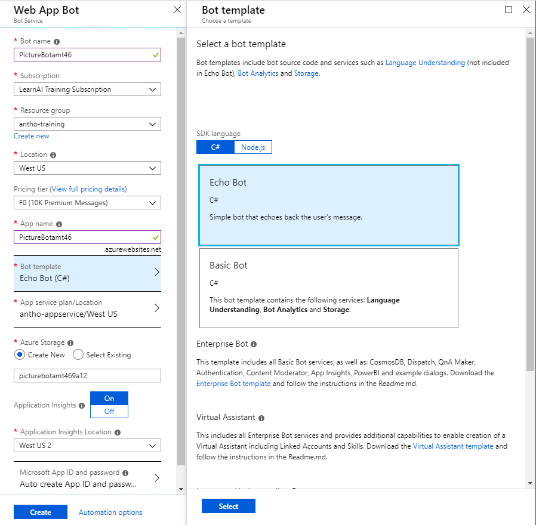
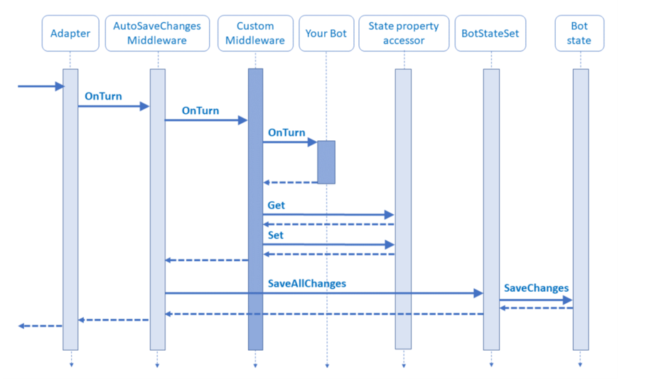
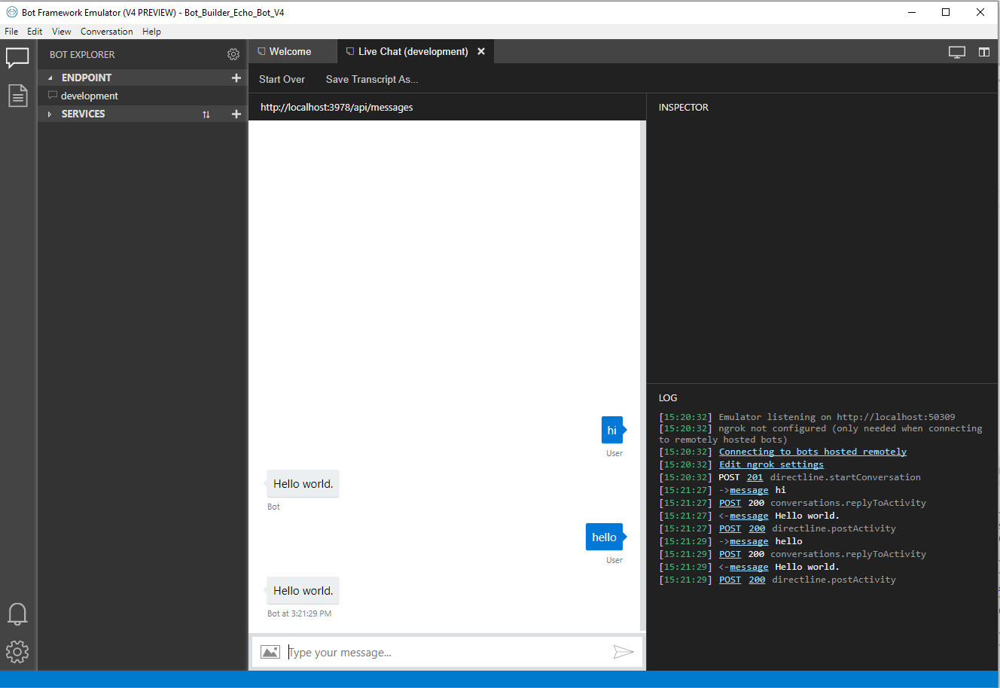
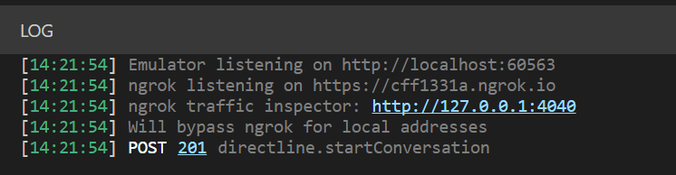

# Lab 3: Creating a Basic filtering bot

## Introduction

Every new technology brings with it as many opportunities as questions, and AI-powered technology has its own unique considerations.
Be mindful of the following AI Ethics principles when designing and implementing your AI tools:

1. *Fairness*: Maximize efficiencies without destroying dignity
1. *Accountability*: AI must be accountable for its algorithm
1. *Transparency*: Guard against bias and destruction of human dignity
1. *Ethical Application*: AI must assist humanity and be designed for intelligent privacy

We encourage you to [Read more](https://ai-ethics.azurewebsites.net/) about the Ethical considerations when building intelligent apps.

## Pre-requisities

1.  Follow the directions provided in [Lab1-Technical_Requirements.md](../Lab1-Technical_Requirements/02-Technical_Requirements.md) to download the v4 Bot Framework Emulator to enable you to test your bot locally.

## Lab 3.0 Create an Azure Web App Bot

A bot created using the Microsoft Bot Framework can be hosted at any publicly-accessible URL.  For the purposes of this lab, we will register our bot using [Azure Bot Service](https://docs.microsoft.com/en-us/bot-framework/bot-service-overview-introduction).

1.  Navigate to the [Azure portal](https://portal.azure.com). 

1.  In the portal, navigate to your resource group, then click **+Add** and search for **bot**. 

1.  Select **Web App Bot**, and click **Create**. 

1.  For the name, you'll have to create a unique identifier. We recommend using something along the lines of PictureBot[i][n] where [i] is your initials and [n] is a number (e.g. mine would be PictureBotamt6). 

1.  Select a region

1.  For pricing tier, select **F0**. 

1.  Select a Bot template of **SDK v4** for **Echo Bot** in **C#**, later we will update it to our our PictureBot.

1.  Click **OK**, make sure that **Echo Bot** is displayed.

1.  Configure a new App service plan (put it in the same location as your bot). You can choose to turn Application Insights on or off. **Do not** change or click on "Auto create App ID and password", we will get to that later. 

1.  Click **Create**



1.  When it's deployed, navigate to the new Azure Web App Bot Resource. 

1.  Under **Bot Management**, click **Settings**

1.  Click the **Manage** link for the **Microsoft App ID**

1.  Click **New client secret**

1.  For the name, type **PictureBot**

1.  For the expires, select **Never**

1.  Click **Add**

1.  Record the secret into notepad or similar for later us in the lab(s).

1.  Click **Overview**, record the application id into notepad or similar for later us in the lab(s).

1.  Navigate back to the **web app bot** resource, select the **Test in Web Chat** tab once it's deployed, and see what it is capable of doing.  As you will see, it only echos back your message.

## Lab 3.1: Creating a simple bot and running it

1.  Open Visual Studio 2019 or later

1.  Click **Create new project**, search for **bot**.

1.  Scroll down until you see **Echo Bot (Bot Framework v4)**, click **Next**

> **Note** If you do not see the Echo Bot template, you need to install the Visual Studio addins from the pre-req steps.

1.  For the name, type **PictureBot**, click **Create**

1.  Spend some time looking at all of the different things that are generated from the Echo Bot template. We won't spend time explaining every single file, but we **highly recommend** spending some time **later** working through and reviewing this sample (and the other Web App Bot sample - Basic Bot), if you have not already. It contains important and useful shells needed for bot development. You can find it and other useful shells and samples [here](https://github.com/Microsoft/BotBuilder-Samples).

1.  Start by right-clicking on the Solution and selecting **Build**. This will restore the nuget packages. 

1.  Open the **appsettings.json** file, update it by adding your bot service information you recorded above:

```json
{
    "MicrosoftAppId": "",
    "MicrosoftAppPassword": ""
}
```

1.  As you may know, renaming a Visual Studio Solution/Project is a very sensitive task. **Carefully** complete the following tasks so all the names reflect PictureBot instead of EchoBot:

1.  Right-click the **Bots/Echobot.cs** file, then select **Rename**, rename the class file to **PictureBot.cs**

1.  Rename the class and then change all references to the class to **PictureBot**.  You will know if you missed one when you go to build the project.

1.  Right-click the project, select **Manage Nuget Packagaes**

1.  Click the **Browse** tab, and install the following packages, ensure that you are using version **4.5.1**:

* Microsoft.Bot.Builder.Azure
* Microsoft.Bot.Builder.AI.Luis
* Microsoft.Bot.Builder.Dialogs
* Microsoft.Azure.Search (version, 9.1.0 or later)

1. Build the solution.

>**TIP**:  If you only have one monitor and you would like to easily switch between instructions and Visual Studio, you can now add the instruction files to your Visual Studio solution by right-clicking on the project in Solution Explorer and selecting **Add > Existing Item**. Navigate to "Lab2," and add all the files of type "MD File."

#### Creating a Hello World bot

So now that we've updated our base shell to support the naming and NuGet packages we'll use throughout the rest of the labs, we're ready to start adding some custom code. First, we'll just create a simple "Hello world" bot that helps you get warmed up to building bots with the V4 SDK.

An important concept is the "turn", used to describe a message to a user and a response from the bot.
For example, if I say "Hello bot" and the bot responds "Hi, how are you?" that is **one** turn. Check in the image below how a **turn** goes through the multiple layers of a bot application.



1.  Open the **PictureBot.cs** file.  

1.  Review the `OnMessageActivityAsync` method with the code below. This method is called every turn of the conversation. You'll see later why that fact is important, but for now, remember that OnMessageActivityAsync is called on every turn.

1.  Press **F5** to start debugging.

A few things to **Note**

* Your default.htm (under wwwroot) page will be displayed in a browser

* Note the localhost port number for the web page. This should (and must) match the endpoint in your Emulator.

>Get stuck or broken? You can find the solution for the lab up until this point under [resources/code/Finished/PictureBot-Part0](./code/Finished/PictureBot-Part0). The readme file within the solution (once you open it) will tell you what keys you need to add in order to run the solution.

#### Using the Bot Framework Emulator

To interact with your bot:

* Launch the Bot Framework Emulator (note we are using the v4 Emulator).  Click **Start**, then search for **Bot Emulator**.

* On the welcome page, click **Create a new bot configuration**

*  For the name, type **PictureBot**

*  Enter the url that is displayed on your bot web page

*  Enter the AppId and the App Secret your entered into the appsettings.json

>**Note** If you do not enter id and secret values into the bot settings you would also not need to enter the values in the bot emulator

*  Click **Save and connect**, then save your .bot file locally

* You should now be able to converse with the bot.

* Type **hello**. The bot will respond with echoing your message.

> **Note** You can select "Restart conversation" to clear the conversation history.



In the Log, you should see something similar to the following:



Note how it says we will bypass ngrok for local addresses. We will not be using ngrok in this workshop, but we would if we were connecting to our published version of the bot, we would do so via the 'production' endpoint. Open the 'production' endpoint and observe the difference between bots in different environments. This can be a useful feature when you're testing and comparing your development bot to your production bot.

You can read more about using the Emulator [here](https://docs.microsoft.com/en-us/azure/bot-service/bot-service-debug-emulator?view=azure-bot-service-4.0).

1.  Browse around and examine the sample bot code. In particular:

- **Startup.cs**: is where we will add services/middleware and configure the HTTP request pipeline. There are many comments within to help you understand what is happening. Spend a few minutes reading through.

- **PictureBot.cs**: The `OnMessageActivityAsync` method is the entry point which waits for a message from the user is where we can react to a message once received and wait for further messages.  We can use `turnContext.SendActivityAsync` to send a message from the bot back to the user.

## Lab 3.2:  Managing state and services

1.  Navigate again to the **Startup.cs** file

1.  Update the list of `using` statements by adding the following:

```csharp
using System;
using System.Linq;
using System.Text.RegularExpressions;
using Microsoft.Bot.Builder.Integration;
using Microsoft.Bot.Configuration;
using Microsoft.Bot.Connector.Authentication;
using Microsoft.Extensions.Options;
using Microsoft.Extensions.Logging;
using Microsoft.PictureBot;

using Microsoft.Bot.Builder.AI.Luis;
using Microsoft.Bot.Builder.Dialogs;
```
We won't use the above just yet, but can you guess when we might?

1.  Focus your attention on the `ConfigureServices` method which is used to add services to the bot. Review the contents carefully, noting what is built in for you.

> A few other notes for a deeper understanding:
>
> * If you're unfamiliar with dependency injection, you can [read more about it here](https://docs.microsoft.com/en-us/aspnet/web-api/overview/advanced/dependency-injection).
> * You can use local memory for this lab and testing purposes. For production, you'll have to implement a way to [manage state data](https://docs.microsoft.com/en-us/azure/bot-service/bot-builder-storage-concept?view=azure-bot-service-4.0). In the big chunk of comments within `ConfigureServices`, there are some tips for this.
> * At the bottom of the method, you may notice we create and register state accessors. Managing state is a key in creating intelligent bots, which you can [read more about here](https://docs.microsoft.com/en-us/azure/bot-service/bot-builder-dialog-state?view=azure-bot-service-4.0).

Fortunately, this shell is pretty comprehensive, so we only have to add two items: 

*   Middleware
*   Custom state accessors.

#### Middleware

Middleware is simply a class or set of classes that sit between the adapter and your bot logic, and are added to your adapter's middleware collection during initialization. 

The SDK allows you to write your own middleware or add reusable components of middleware created by others. Every activity coming in or out of your bot flows through your middleware. We'll get deeper into this later in the lab, but for now, it's important to understand that every activity flows through your middleware, because it is located in the `ConfigureServices` method that gets called at run time (which runs in between every message being sent by a user and `OnMessageActivityAsync`). 

1.  Add a new folder called **Middleware**

1.  Right-click on the **Middleware** folder and select **Add>Existing Item**. 

1.  Navigate to **{GitHubDir}\Lab3-Basic_Filter_Bot\code\Middleware**, select all three files, and select **Add**

1.  Add the following variables to your **Startup** class:

```csharp
private ILoggerFactory _loggerFactory;
private bool _isProduction = false;
```

2.  Replace the code on line 42 

```csharp
services.AddTransient<IBot, PictureBot.Bots.PictureBot>();
``` 
with the following code:

```csharp
services.AddBot<PictureBot.Bots.PictureBot>(options =>
{
    var appId = Configuration.GetSection("MicrosoftAppId")?.Value;
                var appSecret = Configuration.GetSection("MicrosoftAppPassword")?.Value;

                options.CredentialProvider = new SimpleCredentialProvider(appId, appSecret);

    // Creates a logger for the application to use.
    ILogger logger = _loggerFactory.CreateLogger<PictureBot.Bots.PictureBot>();

    // Catches any errors that occur during a conversation turn and logs them.
    options.OnTurnError = async (context, exception) =>
    {
        logger.LogError($"Exception caught : {exception}");
        await context.SendActivityAsync("Sorry, it looks like something went wrong.");
    };

    // The Memory Storage used here is for local bot debugging only. When the bot
    // is restarted, everything stored in memory will be gone.
    IStorage dataStore = new MemoryStorage();

    // For production bots use the Azure Blob or
    // Azure CosmosDB storage providers. For the Azure
    // based storage providers, add the Microsoft.Bot.Builder.Azure
    // Nuget package to your solution. That package is found at:
    // https://www.nuget.org/packages/Microsoft.Bot.Builder.Azure/
    // Uncomment the following lines to use Azure Blob Storage
    // //Storage configuration name or ID from the .bot file.
    // const string StorageConfigurationId = "<STORAGE-NAME-OR-ID-FROM-BOT-FILE>";
    // var blobConfig = botConfig.FindServiceByNameOrId(StorageConfigurationId);
    // if (!(blobConfig is BlobStorageService blobStorageConfig))
    // {
    //    throw new InvalidOperationException($"The .bot file does not contain an blob storage with name '{StorageConfigurationId}'.");
    // }
    // // Default container name.
    // const string DefaultBotContainer = "botstate";
    // var storageContainer = string.IsNullOrWhiteSpace(blobStorageConfig.Container) ? DefaultBotContainer : blobStorageConfig.Container;
    // IStorage dataStore = new Microsoft.Bot.Builder.Azure.AzureBlobStorage(blobStorageConfig.ConnectionString, storageContainer);

    // Create Conversation State object.
    // The Conversation State object is where we persist anything at the conversation-scope.
    var conversationState = new ConversationState(dataStore);

    options.State.Add(conversationState);

    var middleware = options.Middleware;
    // Add middleware below with "middleware.Add(...."
    // Add Regex below
    
});
```

1.  Replace the **Configure** method with the following code:

```csharp
public void Configure(IApplicationBuilder app, IHostingEnvironment env, ILoggerFactory loggerFactory)
{
    _loggerFactory = loggerFactory;

    app.UseDefaultFiles()
        .UseStaticFiles()
        .UseBotFramework();

    app.UseMvc();
}
```

#### Custom state accessors

Before we talk about the custom state accessors that we need, it's important to back up. Dialogs, which we'll really get into in the next section, are an approach to implementing multi-turn conversation logic, which means they'll need to rely on a persisted state to know where in the conversation the users are. In our dialog-based bot, we'll use a DialogSet to hold the various dialogs. The DialogSet is created with a handle to an object called an "accessor".

In the SDK, an accessor implements the `IStatePropertyAccessor` interface, which basically means it provides the ability to get, set, and delete information regarding state, so we can keep track of which step a user is in a conversation.

For each accessor we create, we have to first give it a property name. For our scenario, we want to keep track of a few things:

1. `PictureState`
    * Have we greeted the user yet?
        * We don't want to greet them more than once, but we want to make sure we greet them at the beginning of a conversation.
    * Is the user currently searching for a specific term? If so, what is it?
        * We need to keep track of if the user has told us what they want to search for, and what it is they want to search for if they have.
2. `DialogState`
    * Is the user currently in the middle of a dialog?
        * This is what we'll use to determine where a user is in a given dialog or conversation flow. If you aren't familiar with dialogs, don't worry, we'll get to that soon.

We can use these constructs to keep track of what we'll call `PictureState`. 

1.  In the **ConfigureServices** method of the **Startup.cs** file, add the `PictureState` within the list of custom state accessors and to keep track of the dialogs, you'll use the built-in `DialogState`:

```csharp
// Create and register state accesssors.
// Acessors created here are passed into the IBot-derived class on every turn.
services.AddSingleton<PictureBotAccessors>(sp =>
{
    var options = sp.GetRequiredService<IOptions<BotFrameworkOptions>>().Value;
    if (options == null)
    {
        throw new InvalidOperationException("BotFrameworkOptions must be configured prior to setting up the state accessors");
    }

    var conversationState = options.State.OfType<ConversationState>().FirstOrDefault();
    if (conversationState == null)
    {
        throw new InvalidOperationException("ConversationState must be defined and added before adding conversation-scoped state accessors.");
    }

    // Create the custom state accessor.
    // State accessors enable other components to read and write individual properties of state.
    var accessors = new PictureBotAccessors(conversationState)
    {
        PictureState = conversationState.CreateProperty<PictureState>(PictureBotAccessors.PictureStateName),
        DialogStateAccessor = conversationState.CreateProperty<DialogState>("DialogState"),
    };

    return accessors;
});
```

You should see an error (red squiggly) beneath some of the terms. But before fixing them, you may be wondering why we had to create two accessors, why wasn't one enough?

* `DialogState` is a specific accessor that comes from the `Microsoft.Bot.Builder.Dialogs` library. When a message is sent, the Dialog subsystem will call `CreateContext` on the `DialogSet`. Keeping track of this context requires the `DialogState` accessor specifically to get the appropriate dialog state JSON.
* On the other hand, `PictureState` will be used to track particular conversation properties that we specify throughout the conversation (e.g. Have we greeted the user yet?)

> Don't worry about the dialog jargon yet, but the process should make sense. If you're confused, you can [dive deeper into how state works](https://docs.microsoft.com/en-us/azure/bot-service/bot-builder-dialog-state?view=azure-bot-service-4.0).

Now back to the errors you're seeing. You've said you're going to store this information, but you haven't yet specified where or how. We have to update "PictureState.cs" and "PictureBotAccessor.cs" to have and access the information we want to store.

1.  Right-click the project and select **Add->Class**, select a Class file and name it **PictureState**

1.  Copy the following code into **PictureState.cs**. 

```csharp
using System.Collections.Generic;

namespace Microsoft.PictureBot
{
    /// <summary>
    /// Stores counter state for the conversation.
    /// Stored in <see cref="Microsoft.Bot.Builder.ConversationState"/> and
    /// backed by <see cref="Microsoft.Bot.Builder.MemoryStorage"/>.
    /// </summary>
    public class PictureState
    {
        /// <summary>
        /// Gets or sets the number of turns in the conversation.
        /// </summary>
        /// <value>The number of turns in the conversation.</value>
        public string Greeted { get; set; } = "not greeted";
        public string Search { get; set; } = "";
        public string Searching { get; set; } = "no";
    }
}
```

1.  Review the code.  This is where we'll store information about the active conversation.  Feel free to add some comments explaining the purposes of the strings. Now that you have PictureState appropriately initialized, you can create the PictureBotAccessor, to remove the errors you were getting in **Startup.cs**.

1.  Right-click the project and select **Add->Class**, select a Class file and name it **PictureBotAccessors**

1.  Copy the following into it:

```csharp
using System;
using Microsoft.Bot.Builder;
using Microsoft.Bot.Builder.Dialogs;

namespace Microsoft.PictureBot
{
    /// <summary>
    /// This class is created as a Singleton and passed into the IBot-derived constructor.
    ///  - See <see cref="PictureBot"/> constructor for how that is injected.
    ///  - See the Startup.cs file for more details on creating the Singleton that gets
    ///    injected into the constructor.
    /// </summary>
    public class PictureBotAccessors
    {
        /// <summary>
        /// Initializes a new instance of the <see cref="PictureBotAccessors"/> class.
        /// Contains the <see cref="ConversationState"/> and associated <see cref="IStatePropertyAccessor{T}"/>.
        /// </summary>
        /// <param name="conversationState">The state object that stores the counter.</param>
        public PictureBotAccessors(ConversationState conversationState)
        {
            ConversationState = conversationState ?? throw new ArgumentNullException(nameof(conversationState));
        }

        /// <summary>
        /// Gets the <see cref="IStatePropertyAccessor{T}"/> name used for the <see cref="CounterState"/> accessor.
        /// </summary>
        /// <remarks>Accessors require a unique name.</remarks>
        /// <value>The accessor name for the counter accessor.</value>
        public static string PictureStateName { get; } = $"{nameof(PictureBotAccessors)}.PictureState";

        /// <summary>
        /// Gets or sets the <see cref="IStatePropertyAccessor{T}"/> for CounterState.
        /// </summary>
        /// <value>
        /// The accessor stores the turn count for the conversation.
        /// </value>
        public IStatePropertyAccessor<PictureState> PictureState { get; set; }

        /// <summary>
        /// Gets the <see cref="ConversationState"/> object for the conversation.
        /// </summary>
        /// <value>The <see cref="ConversationState"/> object.</value>
        public ConversationState ConversationState { get; }

        /// <summary> Gets the IStatePropertyAccessor{T} name used for the DialogState accessor. </summary>
        public static string DialogStateName { get; } = $"{nameof(PictureBotAccessors)}.DialogState";

        /// <summary> Gets or sets the IStatePropertyAccessor{T} for DialogState. </summary>
        public IStatePropertyAccessor<DialogState> DialogStateAccessor { get; set; }
    }
}
```

1.  Review the code, notice the implementation of `PictureStateName` and `PictureState`.

1.  Wondering if you configured it correctly? Return to **Startup.cs** and confirm your errors around creating the custom state accessors have been resolved.

## Lab 3.3: Organizing code for bots

There are many different methods and preferences for developing bots. The SDK allows you to organize your code in whatever way you want. In these labs, we'll organize our conversations into different dialogs, and we'll explore a [MVVM style](https://msdn.microsoft.com/en-us/library/hh848246.aspx) of organizing code around conversations.

This PictureBot will be organized in the following way:

* **Dialogs** - the business logic for editing the models
* **Responses** - classes which define the outputs to the users
* **Models** - the objects to be modified

1.  Create two new folders "**Responses**" and "**Models**" within your project. (Hint: You can right-click on the project and select "Add->Folder").

#### Dialogs

You may already be familiar with Dialogs and how they work. If you aren't, read [this page on Dialogs](https://docs.microsoft.com/en-us/azure/bot-service/bot-builder-dialog-manage-conversation-flow?view=azure-bot-service-4.0&tabs=csharp) before continuing.

When a bot has the ability to perform multiple tasks, it is nice to be able to have multiple dialogs, or a set of dialogs, to help users navigate through different conversation flows. For our PictureBot, we want our users to be able to go through an initial menu flow, often referred to as a main dialog, and then branch off to different dialogs depending what they are trying to do - search pictures, share pictures, order pictures, or get help. We can do this easily by using a dialog container or what's referred to here as a `DialogSet`. Read about [creating modular bot logic and complex dialogs](https://docs.microsoft.com/en-us/azure/bot-service/bot-builder-compositcontrol?view=azure-bot-service-4.0&tabs=csharp) before continuing.

For the purposes of this lab, we are going to keep things fairly simple, but after, you should be able to create a dialog set with many dialogs. For our PictureBot, we'll have two main dialogs:

* **MainDialog** - The default dialog the bot starts out with. This dialog will start other dialog(s) as the user requests them. This dialog, as it is the main dialog for the dialog set, will be responsible for creating the dialog container and redirecting users to other dialogs as needed.

* **SearchDialog** - A dialog which manages processing search requests and returning those results to the user.  ***Note** We will evoke this functionality, but will not implement Search in this workshop.*

Since we only have two dialogs, we can keep it simple and put them in the PictureBot class. However, complex scenarios may require splitting them out into different dialogs in a folder (similar to how we'll separate Responses and Models).

1.  Navigate back to **PictureBot.cs** and replace your `using` statements with the following:

```csharp
using System.Threading;
using System.Threading.Tasks;
using Microsoft.Bot.Builder;
using Microsoft.Bot.Schema;
using Microsoft.Bot.Builder.Dialogs;
using Microsoft.Extensions.Logging;
using System.Linq;
using PictureBot.Models;
using PictureBot.Responses;
using Microsoft.Bot.Builder.AI.Luis;
using Microsoft.Azure.Search;
using Microsoft.Azure.Search.Models;
using System;
using Newtonsoft.Json;
using Newtonsoft.Json.Linq;
using Microsoft.PictureBot;
```

You've just added access to your Models/Responses, as well as to the services LUIS and Azure Search. Finally, the Newtonsoft references will help you parse the responses from LUIS, which we will see in a subsequent lab.

Next, we'll need to override the `OnTurnAsync` method with one that processes incoming messages and then routes them through the various dialogs.

1.  Replace the **PictureBot** class with the following:

```csharp
/// <summary>
/// Represents a bot that processes incoming activities.
/// For each user interaction, an instance of this class is created and the OnTurnAsync method is called.
/// This is a Transient lifetime service.  Transient lifetime services are created
/// each time they're requested. For each Activity received, a new instance of this
/// class is created. Objects that are expensive to construct, or have a lifetime
/// beyond the single turn, should be carefully managed.
/// For example, the <see cref="MemoryStorage"/> object and associated
/// <see cref="IStatePropertyAccessor{T}"/> object are created with a singleton lifetime.
/// </summary>
/// <seealso cref="https://docs.microsoft.com/en-us/aspnet/core/fundamentals/dependency-injection?view=aspnetcore-2.1"/>
/// <summary>Contains the set of dialogs and prompts for the picture bot.</summary>
public class PictureBot : ActivityHandler
{
    private readonly PictureBotAccessors _accessors;
    // Initialize LUIS Recognizer

    private readonly ILogger _logger;
    private DialogSet _dialogs;

    /// <summary>
    /// Every conversation turn for our PictureBot will call this method.
    /// There are no dialogs used, since it's "single turn" processing, meaning a single
    /// request and response. Later, when we add Dialogs, we'll have to navigate through this method.
    /// </summary>
    /// <param name="turnContext">A <see cref="ITurnContext"/> containing all the data needed
    /// for processing this conversation turn. </param>
    /// <param name="cancellationToken">(Optional) A <see cref="CancellationToken"/> that can be used by other objects
    /// or threads to receive notice of cancellation.</param>
    /// <returns>A <see cref="Task"/> that represents the work queued to execute.</returns>
    /// <seealso cref="BotStateSet"/>
    /// <seealso cref="ConversationState"/>
    /// <seealso cref="IMiddleware"/>
    public override async Task OnTurnAsync(ITurnContext turnContext, CancellationToken cancellationToken = default(CancellationToken))
    {
        if (turnContext.Activity.Type is "message")
        {
            // Establish dialog context from the conversation state.
            var dc = await _dialogs.CreateContextAsync(turnContext);
            // Continue any current dialog.
            var results = await dc.ContinueDialogAsync(cancellationToken);

            // Every turn sends a response, so if no response was sent,
            // then there no dialog is currently active.
            if (!turnContext.Responded)
            {
                // Start the main dialog
                await dc.BeginDialogAsync("mainDialog", null, cancellationToken);
            }
        }
    }
    /// <summary>
    /// Initializes a new instance of the <see cref="PictureBot"/> class.
    /// </summary>
    /// <param name="accessors">A class containing <see cref="IStatePropertyAccessor{T}"/> used to manage state.</param>
    /// <param name="loggerFactory">A <see cref="ILoggerFactory"/> that is hooked to the Azure App Service provider.</param>
    /// <seealso cref="https://docs.microsoft.com/en-us/aspnet/core/fundamentals/logging/?view=aspnetcore-2.1#windows-eventlog-provider"/>
    public PictureBot(PictureBotAccessors accessors, ILoggerFactory loggerFactory /*, LuisRecognizer recognizer*/)
    {
        if (loggerFactory == null)
        {
            throw new System.ArgumentNullException(nameof(loggerFactory));
        }

        // Add instance of LUIS Recognizer

        _logger = loggerFactory.CreateLogger<PictureBot>();
        _logger.LogTrace("PictureBot turn start.");
        _accessors = accessors ?? throw new System.ArgumentNullException(nameof(accessors));

        // The DialogSet needs a DialogState accessor, it will call it when it has a turn context.
        _dialogs = new DialogSet(_accessors.DialogStateAccessor);

        // This array defines how the Waterfall will execute.
        // We can define the different dialogs and their steps here
        // allowing for overlap as needed. In this case, it's fairly simple
        // but in more complex scenarios, you may want to separate out the different
        // dialogs into different files.
        var main_waterfallsteps = new WaterfallStep[]
        {
            GreetingAsync,
            MainMenuAsync,
        };
        var search_waterfallsteps = new WaterfallStep[]
        {
            // Add SearchDialog water fall steps

        };

        // Add named dialogs to the DialogSet. These names are saved in the dialog state.
        _dialogs.Add(new WaterfallDialog("mainDialog", main_waterfallsteps));
        _dialogs.Add(new WaterfallDialog("searchDialog", search_waterfallsteps));
        // The following line allows us to use a prompt within the dialogs
        _dialogs.Add(new TextPrompt("searchPrompt"));
    }
    // Add MainDialog-related tasks

    // Add SearchDialog-related tasks

    // Add search related tasks

}
```

Spend some time reviewing and discussing this shell with a fellow workshop participant. You should understand the purpose of each line before continuing.

We'll add some more to this in a bit. You can ignore any errors for now.

#### Responses

So before we fill out our dialogs, we need to have some responses ready. Remember, we're going to keep dialogs and responses separate, because it results in cleaner code, and an easier way to follow the logic of the dialogs. If you don't agree or understand now, you will soon.

1.  In the **Responses** folder, create two classes, called **MainResponses.cs** and **SearchResponses.cs**. As you may have figured out, the Responses files will simply contain the different outputs we may want to send to users, no logic.

1.  Within **MainResponses.cs** add the following:

```csharp
using System.Threading.Tasks;
using Microsoft.Bot.Builder;

namespace PictureBot.Responses
{
    public class MainResponses
    {
        public static async Task ReplyWithGreeting(ITurnContext context)
        {
            // Add a greeting
        }
        public static async Task ReplyWithHelp(ITurnContext context)
        {
            await context.SendActivityAsync($"I can search for pictures, share pictures and order prints of pictures.");
        }
        public static async Task ReplyWithResumeTopic(ITurnContext context)
        {
            await context.SendActivityAsync($"What can I do for you?");
        }
        public static async Task ReplyWithConfused(ITurnContext context)
        {
            // Add a response for the user if Regex or LUIS doesn't know
            // What the user is trying to communicate
        }
        public static async Task ReplyWithLuisScore(ITurnContext context, string key, double score)
        {
            await context.SendActivityAsync($"Intent: {key} ({score}).");
        }
        public static async Task ReplyWithShareConfirmation(ITurnContext context)
        {
            await context.SendActivityAsync($"Posting your picture(s) on twitter...");
        }
        public static async Task ReplyWithOrderConfirmation(ITurnContext context)
        {
            await context.SendActivityAsync($"Ordering standard prints of your picture(s)...");
        }
    }
}
```

Note that there are two responses with no values (ReplyWithGreeting and ReplyWithConfused). Fill these in as you see fit.

1.  Within "SearchResponses.cs" add the following:

```csharp
using Microsoft.Bot.Builder;
using System;
using System.Collections.Generic;
using System.Linq;
using System.Threading.Tasks;
using Microsoft.Bot.Schema;

namespace PictureBot.Responses
{
    public class SearchResponses
    {
        // add a task called "ReplyWithSearchRequest"
        // it should take in the context and ask the
        // user what they want to search for
        public static async Task ReplyWithSearchConfirmation(ITurnContext context, string utterance)
        {
            await context.SendActivityAsync($"Ok, searching for pictures of {utterance}");
        }
        public static async Task ReplyWithNoResults(ITurnContext context, string utterance)
        {
            await context.SendActivityAsync("There were no results found for \"" + utterance + "\".");
        }
    }
}
```

1.  Notice a whole task is missing. Fill in as you see fit, but make sure the new task has the name "ReplyWithSearchRequest", or you may have issues later.

#### Models

Due to time limitations, we will not be walking through creating all the models. They are straightforward, but we recommend taking some time to review the code within after you've added them. 

1.  Right-click on the **Models** folder and select **Add>Existing Item**. 

1.  Navigate to **{GitHubDir}\Lab3-Basic_Filter_Bot\code\Models**, select all three files, and select **Add**.

## Lab 3.4: Regex and Middleware

There are a number of things that we can do to improve our bot.  First of all, we may not want to call LUIS for a simple "search pictures" message, which the bot will get fairly frequently from its users.  A simple regular expression could match this, and save us time (due to network latency) and money (due to cost of calling the LUIS service).

Also, as the complexity of our bot grows and we are taking the user's input and using multiple services to interpret it, we need a process to manage that flow.  For example, try regular expressions first, and if that doesn't match, call LUIS, and then perhaps we also drop down to try other services like [QnA Maker](http://qnamaker.ai) or Azure Search. A great way to manage this is through [Middleware](https://docs.microsoft.com/en-us/azure/bot-service/bot-builder-concept-middleware?view=azure-bot-service-4.0), and the SDK does a great job supporting that.

Before continuing with the lab, learn more about middleware and the Bot Framework SDK:

1. [Overview and Architecture](https://docs.microsoft.com/en-us/azure/bot-service/bot-builder-basics?view=azure-bot-service-4.0)

1. [Middleware](https://docs.microsoft.com/en-us/azure/bot-service/bot-builder-concept-middleware?view=azure-bot-service-4.0)

1. [Creating Middleware](https://docs.microsoft.com/en-us/azure/bot-service/bot-builder-create-middleware?view=azure-bot-service-4.0&tabs=csaddmiddleware%2Ccsetagoverwrite%2Ccsmiddlewareshortcircuit%2Ccsfallback%2Ccsactivityhandler)

Ultimately, we'll use some middleware to try to understand what users are saying with regular expressions (Regex) first, and if we can't, we'll call LUIS. If we still can't, then we'll drop down to a generic "I'm not sure what you mean" response, or whatever you put for "ReplyWithConfused."

1.  In **Startup.cs**, below the "Add Regex below" comment within `ConfigureServices`, add the following:

```csharp
middleware.Add(new RegExpRecognizerMiddleware()
.AddIntent("search", new Regex("search picture(?:s)*(.*)|search pic(?:s)*(.*)", RegexOptions.IgnoreCase))
.AddIntent("share", new Regex("share picture(?:s)*(.*)|share pic(?:s)*(.*)", RegexOptions.IgnoreCase))
.AddIntent("order", new Regex("order picture(?:s)*(.*)|order print(?:s)*(.*)|order pic(?:s)*(.*)", RegexOptions.IgnoreCase))
.AddIntent("help", new Regex("help(.*)", RegexOptions.IgnoreCase)));

```

1.  You may notice that the `options.State` has been deprecated.  Let's migrate to the newest method:

1.  Remove the following code:

```csharp
var conversationState = new ConversationState(dataStore);

options.State.Add(conversationState);
```

1.  Replace it with

```csharp
var userState = new UserState(dataStore);
var conversationState = new ConversationState(dataStore);

// Create the User state.
services.AddSingleton<UserState>(userState);

// Create the Conversation state.
services.AddSingleton<ConversationState>(conversationState);
```

1.  Also replace the `Configure` code to now pull from the dependency injection version:

```csharp
var conversationState = options.State.OfType<ConversationState>().FirstOrDefault();
if (conversationState == null)
{
    throw new InvalidOperationException("ConversationState must be defined and added before adding conversation-scoped state accessors.");
}
```

1.  Replace it with

```csharp
var conversationState = services.BuildServiceProvider().GetService<ConversationState>();

if (conversationState == null)
{
    throw new InvalidOperationException("ConversationState must be defined and added before adding conversation-scoped state accessors.");
}
```

> We're really just skimming the surface of using regular expressions. If you're interested, you can [learn more here](https://docs.microsoft.com/en-us/dotnet/standard/base-types/regular-expression-language-quick-reference).

Without adding LUIS, our bot is really only going to pick up on a few variations, but it should capture a good bit of messages, if the users are using the bot for searching and sharing and ordering pictures.

> Aside: One might argue that the user shouldn't have to type "help" to get a menu of clear options on what the bot can do; rather, this should be the default experience on first contact with the bot.  **Discoverability** is one of the biggest challenges for bots - letting the users know what the bot is capable of doing.  Good [bot design principles](https://docs.microsoft.com/en-us/bot-framework/bot-design-principles) can help.

## Lab 3.5: Running the bot

#### MainDialog, Again

Let's get down to business. We need to fill out MainDialog within PictureBot.cs so that our bot can react to what users say they want to do.  Based on our results from Regex, we need to direct the conversation in the right direction. Read the code carefully to confirm you understand what it's doing.

1.  In **PictureBot.cs**, paste in the following method code:

```csharp
// If we haven't greeted a user yet, we want to do that first, but for the rest of the
// conversation we want to remember that we've already greeted them.
private async Task<DialogTurnResult> GreetingAsync(WaterfallStepContext stepContext, CancellationToken cancellationToken)
{
    // Get the state for the current step in the conversation
    var state = await _accessors.PictureState.GetAsync(stepContext.Context, () => new PictureState());

    // If we haven't greeted the user
    if (state.Greeted == "not greeted")
    {
        // Greet the user
        await MainResponses.ReplyWithGreeting(stepContext.Context);
        // Update the GreetedState to greeted
        state.Greeted = "greeted";
        // Save the new greeted state into the conversation state
        // This is to ensure in future turns we do not greet the user again
        await _accessors.ConversationState.SaveChangesAsync(stepContext.Context);
        // Ask the user what they want to do next
        await MainResponses.ReplyWithHelp(stepContext.Context);
        // Since we aren't explicitly prompting the user in this step, we'll end the dialog
        // When the user replies, since state is maintained, the else clause will move them
        // to the next waterfall step
        return await stepContext.EndDialogAsync();
    }
    else // We've already greeted the user
    {
        // Move to the next waterfall step, which is MainMenuAsync
        return await stepContext.NextAsync();
    }

}

// This step routes the user to different dialogs
// In this case, there's only one other dialog, so it is more simple,
// but in more complex scenarios you can go off to other dialogs in a similar
public async Task<DialogTurnResult> MainMenuAsync(WaterfallStepContext stepContext, CancellationToken cancellationToken)
{
    // Check if we are currently processing a user's search
    var state = await _accessors.PictureState.GetAsync(stepContext.Context);

    // If Regex picks up on anything, store it
    var recognizedIntents = stepContext.Context.TurnState.Get<IRecognizedIntents>();
    // Based on the recognized intent, direct the conversation
    switch (recognizedIntents.TopIntent?.Name)
    {
        case "search":
            // switch to the search dialog
            return await stepContext.BeginDialogAsync("searchDialog", null, cancellationToken);
        case "share":
            // respond that you're sharing the photo
            await MainResponses.ReplyWithShareConfirmation(stepContext.Context);
            return await stepContext.EndDialogAsync();
        case "order":
            // respond that you're ordering
            await MainResponses.ReplyWithOrderConfirmation(stepContext.Context);
            return await stepContext.EndDialogAsync();
        case "help":
            // show help
            await MainResponses.ReplyWithHelp(stepContext.Context);
            return await stepContext.EndDialogAsync();
        default:
            {
                await MainResponses.ReplyWithConfused(stepContext.Context);
                return await stepContext.EndDialogAsync();
            }
    }
}
```

1.  Press **F5** to run the bot. 

1.  Using the bot emulator, test the bot by sending some commands:

-   help
-   share pics
-   order pics
-   search pics

> **Note** If you get a 500 error in your bot, you can place a break point in the **Startup.cs** file inside the **OnTurnError** delegate method.  The most common error is a mismatch of the AppId and AppSecret.

1.  If the only thing that didn't give you the expected result was "search pics", everything is working how you configured it. "search pics" failing is the expected behavior at this point in the lab, but why? Have an answer before you move on!

>Hint: Use break points to trace matching to case "search", starting from **PictureBot.cs**.

>Get stuck or broken? You can find the solution for the lab up until this point under [resources/code/Finished](./code/Finished). The readme file within the solution (once you open it) will tell you what keys you need to add in order to run the solution. We recommend using this as a reference, not as a solution to run, but if you choose to run it, be sure to add the necessary keys for your enviroment.

##  Resources

-   [Bot Builder Basics](https://docs.microsoft.com/en-us/azure/bot-service/bot-builder-basics?view=azure-bot-service-4.0&tabs=cs)
-   [.NET Bot Builder SDK tutorial](https://docs.microsoft.com/en-us/azure/bot-service/dotnet/bot-builder-dotnet-sdk-quickstart?view=azure-bot-service-4.0)
-   [Bot Service Documentation](https://docs.microsoft.com/en-us/azure/bot-service/bot-service-overview-introduction?view=azure-bot-service-4.0)
-   [Deploy your bot](https://docs.microsoft.com/en-us/azure/bot-service/bot-builder-deploy-az-cli?view=azure-bot-service-4.0&tabs=newrg)

##  Next Steps

-   [Lab 04-01: Log Chat](../Lab4-Log_Chat/01-Introduction.md)