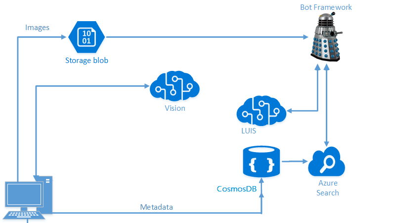

# Developing Intelligent Applications with LUIS and Azure Search

This hands-on lab guides you through creating an intelligent bot from end-to-end using the Microsoft Bot Framework, Azure Search, and Microsoft's Language Understanding Intelligent Service (LUIS).

> **[08/15/2018] Important Note!**
> The v4 SDK for the bot framework recently went [public preview](https://github.com/Microsoft/botbuilder-dotnet). It is unknown when it will go GA. If you would like to complete lab02.2-building_bots with the v4 SDK (instead of the v3 SDK), we have made that the default lab for 2.2.
> If you are using these materials as part of a class (i.e. not self-study), **defer to instructor guidance**.
> If you are an instructor redelivering this course and have questions, please email learnanalytics@microsoft.com.

## Objectives
In this workshop, you will:
- Understand how to implement Azure Search features to provide a positive search experience inside applications
- Build an intelligent bot using Microsoft Bot Framework that leverages LUIS and Azure Search
- Use Regular Expressions and Scorable Groups to make bots more efficient

## Prerequisites

This workshop is meant for an AI Developer on Azure. Since this is a short workshop, there are certain things you need before you arrive.

Firstly, you should have experience with Visual Studio. We will be using it for everything we are building in the workshop, so you should be familiar with [how to use it](https://docs.microsoft.com/en-us/visualstudio/ide/visual-studio-ide) to create applications. Additionally, this is not a class where we teach you how to code or develop applications. We assume you know how to code in C# (you can learn [here](https://mva.microsoft.com/en-us/training-courses/c-fundamentals-for-absolute-beginners-16169?l=Lvld4EQIC_2706218949)), but you do not know how to implement advanced Search and NLP (natural language processing) solutions.

Secondly, you should have some experience developing bots with Microsoft's Bot Framework. We won't spend a lot of time discussing how to design them or how dialogs work. If you are not familiar with the Bot Framework, you should take [this Microsoft Virtual Academy course](https://mva.microsoft.com/en-us/training-courses/creating-bots-in-the-microsoft-bot-framework-using-c-17590#!) prior to attending the workshop.

Thirdly, you should have experience with the portal and be able to create resources (and spend money) on Azure. We will not be providing Azure passes for this workshop.

>**Note** This workshop was developed and tested on a Data Science Virtual Machine (DSVM) with Visual Studio Community Version 15.4.0

## Introduction

We're going to build an end-to-end scenario that allows you to pull in your own pictures, use Cognitive Services to find objects and people in the images, figure out how those people are feeling, and store all of that data into a NoSQL Store (CosmosDB). We'll use that NoSQL Store to populate an Azure Search index, and then build a Bot Framework bot using LUIS to allow easy, targeted querying.

> **Note** This lab combines some of the results obtained from various labs (Computer Vision, Azure Search, and LUIS) from earlier in this workshop. If you did not complete the above listed labs, you will need to complete the Azure Search and LUIS lab before moving forwards. Alternatively, you can request to use a neighbor's keys from their Azure Search/LUIS labs.

## Architecture

In a previous lab, we built a simple C# application that allows you to ingest pictures from your local drive, then invoke the [Computer Vision](https://www.microsoft.com/cognitive-services/en-us/computer-vision-api) Cognitive Service to grab tags and a description for those images.

Once we had this data, we processed it and stored all the information needed in [CosmosDB](https://azure.microsoft.com/en-us/services/documentdb/), our [NoSQL](https://en.wikipedia.org/wiki/NoSQL) [PaaS](https://azure.microsoft.com/en-us/overview/what-is-paas/) offering.

Once we had it in CosmosDB, we built an [Azure Search](https://azure.microsoft.com/en-us/services/search/) Index on top of it. Next, we will build a [Bot Framework](https://dev.botframework.com/) bot to query it. We'll also extend this bot with [LUIS](https://www.microsoft.com/cognitive-services/en-us/language-understanding-intelligent-service-luis) to automatically derive intent from your queries and use those to direct your searches intelligently.

> This lab was modified from this [Cognitive Services Tutorial](https://github.com/noodlefrenzy/CognitiveServicesTutorial).

## Navigating the GitHub ##

There are several directories in the [resources](./resources) folder:

- **assets**, **case**, **instructor**: You can ignore these folders for the purposes of this lab.
- **code**: In here, there are several directories that we will use:
	- **Models**: These classes will be used when we add search to our PictureBot.
	- **Finished-PictureBot_Regex**: Here there is the finished PictureBot.sln that includes additions for Regex. If you fall behind or get stuck, you can refer to this.
	- **Finished-PictureBot_Search**: Here there is the finished PictureBot.sln that includes additions for Regex and Search. If you fall behind or get stuck, you can refer to this.
	- **Finished-PictureBot_LUIS**: Here there is the finished PictureBot.sln that includes additions for Regex, LUIS and Azure Search. If you fall behind or get stuck, you can refer to this.

> You need Visual Studio to run these labs, but if you have already deployed a Windows Data Science Virtual Machine for one of the workshops, you could use that.

## Collecting the Keys

Over the course of this lab, we will collect various keys. It is recommended that you save all of them in a text file, so you can easily access them throughout the workshop.

>_Keys_
>- LUIS API:
>- Cosmos DB Connection String:
>- Azure Search Name:
>- Azure Search Key:
>- Bot Framework App Name:
>- Bot Framework App ID:
>- Bot Framework App Password:

## Navigating the Labs

This workshop has been broken down into five sections:
- [1_Regex_and_ScorableGroups](./1_Regex_and_ScorableGroups.md): Here you will build a simple bot using Regular Expressions and Scorable Groups
- [2_Azure_Search](./2_Azure_Search.md): We'll configure our bot for Azure Search and connect it to the Azure Search service from the previous lab
- [3_LUIS](./3_LUIS): Next, we'll incorporate our LUIS model into our bot, so that we can call LUIS when Regex does not recognize a user's intent.
- [4_Publish_and_Register](./4_Publish_and_Register.md): We'll finish by publishing and registering our bot.
- [5_Challenge_and_Closing](./5_Challenge_and_Closing.md): If you get through all the labs, try this challenge. You will also find a summary of what you've done and where to learn more.

### Continue to [1_Regex_and_ScorableGroups](./1_Regex_and_ScorableGroups.md)

