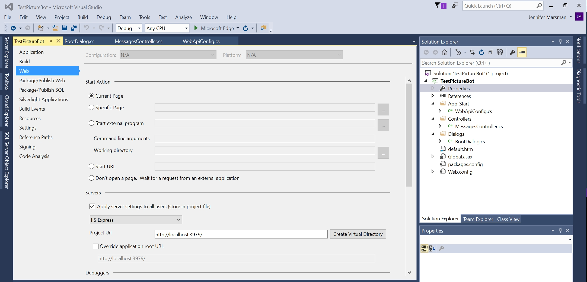

## 1_Regex_and_ScorableGroups:
Estimated Time: 10-15 minutes

## Building a Bot

We assume that you've had some exposure to the Bot Framework. If you have, great. If not, don't worry too much, you'll learn a lot in this section. We recommend completing [this Microsoft Virtual Academy course](https://mva.microsoft.com/en-us/training-courses/creating-bots-in-the-microsoft-bot-framework-using-c-17590#!) and checking out the [documentation](https://docs.microsoft.com/en-us/bot-framework/).

### Lab 1.1: Setting up for bot development

We will be developing a bot using the C# SDK.  To get started, you need two things:
1. The Bot Framework project template, which you can download [here](http://aka.ms/bf-bc-vstemplate).  The file is called "Bot Application.zip" and you should save it into the \Documents\Visual Studio 2017\Templates\ProjectTemplates\Visual C#\ directory.  Just drop the whole zipped file in there; no need to unzip.  
2. Download the Bot Framework Emulator for testing your bot locally [here](https://github.com/Microsoft/BotFramework-Emulator/releases/download/v3.5.33/botframework-emulator-Setup-3.5.33.exe).  The emulator installs to `c:\Users\`_your-username_`\AppData\Local\botframework\app-3.5.33\botframework-emulator.exe` or your Downloads folder, depending on browser.

### Lab 1.2: Creating a simple bot and running it

In Visual Studio, go to File --> New Project and create a Bot Application named "PictureBot". Make sure you name it "PictureBot" or you may have issues later on.  

 

>The rest of the **Creating a simple bot and running it** lab is optional. Per the prerequisites, you should have experience working with the Bot Framework. You can hit F5 to confirm it builds correctly, and move on to the next lab.

Browse around and examine the sample bot code, which is an echo bot that repeats back your message and its length in characters.  In particular, note:
+ In **WebApiConfig.cs** under App_Start, the route template is api/{controller}/{id} where the id is optional.  That is why we always call the bot's endpoint with api/messages appended at the end.  
+ The **MessagesController.cs** under Controllers is therefore the entry point into your bot.  Notice that a bot can respond to many different activity types, and sending a message will invoke the RootDialog.  
+ In **RootDialog.cs** under Dialogs, "StartAsync" is the entry point which waits for a message from the user, and "MessageReceivedAsync" is the method that will handle the message once received and then wait for further messages.  We can use "context.PostAsync" to send a message from the bot back to the user.  

Click F5 to run the sample code.  NuGet should take care of downloading the appropriate dependencies.  

The code will launch in your default web browser in a URL similar to http://localhost:3979/.  

> Fun Aside: why this port number?  It is set in your project properties.  In your Solution Explorer, double-click "Properties" and select the "Web" tab.  The Project URL is set in the "Servers" section.  

 

Make sure your project is still running (hit F5 again if you stopped to look at the project properties) and launch the Bot Framework Emulator.  (If you just installed it, it may not be indexed to show up in a search on your local machine, so remember that it installs to c:\Users\your-username\AppData\Local\botframework\app-3.5.27\botframework-emulator.exe.)  Ensure that the Bot URL matches the port number that your code launched in above, and has api/messages appended to the end.  You should be able to converse with the bot.  

 


### Lab 1.3: Regular expressions and scorable groups

There are a number of things that we can do to improve our bot.  First of all, we may not want to call LUIS for a simple "hi" greeting, which the bot will get fairly frequently from its users.  A simple regular expression could match this, and save us time (due to network latency) and money (due to cost of calling the LUIS service).  

Also, as the complexity of our bot grows, and we are taking the user's input and using multiple services to interpret it, we need a process to manage that flow.  For example, try regular expressions first, and if that doesn't match, call LUIS, and then perhaps we also drop down to try other services like [QnA Maker](http://qnamaker.ai) and Azure Search.  A great way to manage this is [ScorableGroups](https://blog.botframework.com/2017/07/06/Scorables/).  ScorableGroups give you an attribute to impose an order on these service calls.  In our code, let's impose an order of matching on regular expressions first, then calling LUIS for interpretation of utterances, and finally lowest priority is to drop down to a generic "I'm not sure what you mean" response.    

To use ScorableGroups, your RootDialog will need to inherit from DispatchDialog instead of LuisDialog (but you can still have the LuisModel attribute on the class).  You also will need a reference to Microsoft.Bot.Builder.Scorables (as well as others).  So in your RootDialog.cs file, add:

```csharp

using Microsoft.Bot.Builder.Scorables;
using System.Collections.Generic;

```

and change your class derivation to:

```csharp

    public class RootDialog : DispatchDialog<object>

```

Next, delete the two existing methods in the class (StartAsync and MessageReceivedAsync). 

Let's add some new methods that match regular expressions as our first priority in ScorableGroup 0.  Add the following at the beginning of your RootDialog class:

```csharp

        [RegexPattern("^Hello|hello")]
        [RegexPattern("^Hi|hi")]
        [ScorableGroup(0)]
        public async Task Hello(IDialogContext context, IActivity activity)
        {
            await context.PostAsync("Hello from RegEx!  I am a Photo Organization Bot.  I can search your photos, share your photos on Twitter, and order prints of your photos.  You can ask me things like 'find pictures of food'.");
        }

        [RegexPattern("^Help|help")]
        [ScorableGroup(0)]
        public async Task Help(IDialogContext context, IActivity activity)
        {
            // Launch help dialog with button menu  
            List<string> choices = new List<string>(new string[] { "Search Pictures", "Share Picture", "Order Prints" });
            PromptDialog.Choice<string>(context, ResumeAfterChoice, 
                new PromptOptions<string>("How can I help you?", options:choices));
        }

        private async Task ResumeAfterChoice(IDialogContext context, IAwaitable<string> result)
        {
            string choice = await result;
            
            switch (choice)
            {
                case "Search Pictures":
                    // PromptDialog.Text(context, ResumeAfterSearchTopicClarification,
                    //     "What kind of picture do you want to search for?");
                    break;
                case "Share Picture":
                    //await SharePic(context, null);
                    break;
                case "Order Prints":
                    //await OrderPic(context, null);
                    break;
                default:
                    await context.PostAsync("I'm sorry. I didn't understand you.");
                    break;
            }
        }

```

This code will match on expressions from the user that start with "hi", "hello", and "help".  Select F5 and test your bot. Notice that when the user asks for help, we present him/her with a simple menu of buttons on the three core things our bot can do: search pictures, share pictures, and order prints.  

> Fun Aside: One might argue that the user shouldn't have to type "help" to get a menu of clear options on what the bot can do; rather, this should be the default experience on first contact with the bot.  **Discoverability** is one of the biggest challenges for bots - letting the users know what the bot is capable of doing.  Good [bot design principles](https://docs.microsoft.com/en-us/bot-framework/bot-design-principles) can help.   

This setup will make it easier when we resort to LUIS (later) as our second attempt if no regular expression matches, in Scorable Group 1.  


### Continue to [2_Azure_Search](./2_Azure_Search.md)  
Back to [README](./0_README.md)
