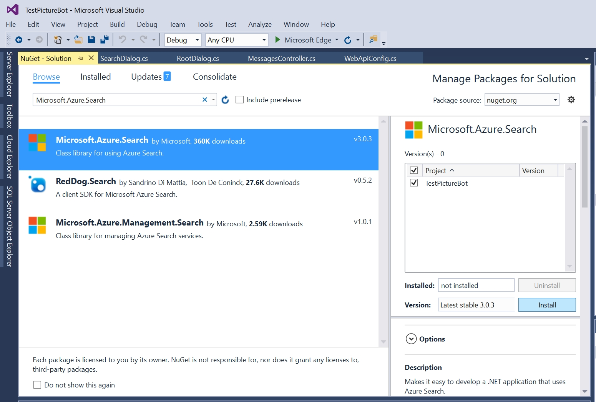

## 2_Azure_Search:
Estimated Time: 10-15 minutes

### Lab 2.1: Configure your bot for Azure Search 

First, we need to provide our bot with the relevant information to connect to an Azure Search index.  The best place to store connection information is in the configuration file.  

Open Web.config and in the appSettings section, add the following:

```xml    
    <!-- Azure Search Settings -->
    <add key="SearchDialogsServiceName" value="" />
    <add key="SearchDialogsServiceKey" value="" />
    <add key="SearchDialogsIndexName" value="images" />
```

Set the value for the SearchDialogsServiceName to be the name of the Azure Search Service that you created earlier.  If needed, go back and look this up in the [Azure portal](https://portal.azure.com).  

Set the value for the SearchDialogsServiceKey to be the key for this service.  This can be found in the [Azure portal](https://portal.azure.com) under the Keys section for your Azure Search.  In the below screenshot, the SearchDialogsServiceName would be "aiimmersionsearch" and the SearchDialogsServiceKey would be "375...".  

 

### Lab 2.2: Update the bot to use Azure Search

Next, we'll update the bot to call Azure Search.  First, open Tools-->NuGet Package Manager-->Manage NuGet Packages for Solution.  In the search box, type "Microsoft.Azure.Search".  Select the corresponding library, check the box that indicates your project, and install it.  It may install other dependencies as well. Under installed packages, you may also need to update the "Newtonsoft.Json" package.

 

Right-click on your project in the Solution Explorer of Visual Studio, and select Add-->New Folder.  Create a folder called "Models".  Then right-click on the Models folder, and select Add-->Existing Item.  Do this twice to add these two files under the Models folder (make sure to adjust your namespaces if necessary):
1. [ImageMapper.cs](./resources/code/Models/ImageMapper.cs)
2. [SearchHit.cs](./resources/code/Models/SearchHit.cs)

>You can find the files in this repository under [resources/code/Models](./resources/code/Models)

Next, right-click on the Dialogs folder in the Solution Explorer of Visual Studio, and select Add-->Class.  Call your class "SearchDialog.cs". Add the contents from [here](./resources/code/SearchDialog.cs).

Review the contents of the files you just added. Discuss with a neighbor what each of them does.

We also need to update your RootDialog to call the SearchDialog.  In RootDialog.cs in the Dialogs folder, directly under the `ResumeAfterChoice` method, add these "ResumeAfter" methods:

```csharp

        private async Task ResumeAfterSearchTopicClarification(IDialogContext context, IAwaitable<string> result)
        {
            string searchTerm = await result;
            context.Call(new SearchDialog(searchTerm), ResumeAfterSearchDialog);
        }

        private async Task ResumeAfterSearchDialog(IDialogContext context, IAwaitable<object> result)
        {
            await context.PostAsync("Done searching pictures");
        }

```

In RootDialog.cs, you will also need to remove the comments (the `//` at the beginning) from the line: `PromptDialog.Text(context, ResumeAfterSearchTopicClarification, "What kind of picture do you want to search for?");` within the `ResumeAfterChoice` method.

Press F5 to run your bot again.  In the Bot Emulator, try searching for something like "dogs" or "water".  Ensure that you are seeing results when tags from your pictures are requested.  


### Continue to [3_LUIS](./3_LUIS.md)  
Back to [README](./0_README.md)
