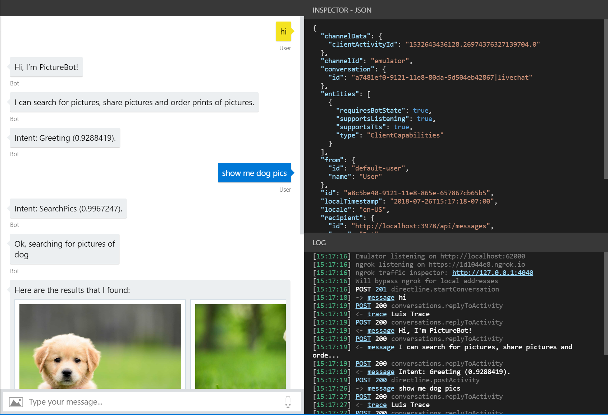
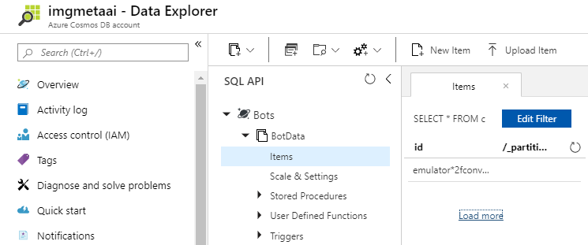

# Lab 4: Log Chats

## Prerequisites

This lab starts from the assumption that you have built and published the bot from [Lab 3](../Lab3-Basic_Filter_Bot/02-Basic_Filter_Bot.md).
It is recommended that you do that lab in order to be able to implement logging as covered in this lab. If you have not, reading carefully through all the exercises and looking at some of the code or using it in your own applications may be sufficient, depending on your needs.

if you did not complete **Lab 3** you can find final project [here](../Lab3-Basic_Filter_Bot/code/FinishedPictureBot-Part1).

## Lab 4.0: Objectives

This lab demonstrates how you can perform logging using Microsoft Bot Framework and store aspects of chat conversations. After completing the lab, you should be able to:

- Understand how to intercept and log message activities between bots and users
- Log utterances to file storage

> Note: for these labs, we will be using the v4 of the Microsoft Bot Framework SDK. If you would like to perform similar labs with the v3 SDK, refer [here](./other-resources/SDK_V3_Labs).

## Lab 4.1: Intercepting and analyzing messages

In this lab, we'll look at some different ways that the Bot Framework allows us to intercept and log data from conversations that the bot has with users. We'll start by looking at how, without implementing any memory solution, we're able to view messages and what's contained in them. This is good for testing purposes, but not ideal for production environments.

After, we'll look at a very simple implementation of how we can write data from conversations to a file. Specifically, we'll put messages users send to the bot in a list, and store the list, along with a few other items, in a temporary file (though you could change this to a specific file path as needed)

#### Using the Bot Framework Emulator

Let's take a look and what information we can glean, for testing purposes, without adding anything to our bot.

Open your PictureBot.sln in Visual Studio. Since we've published our bot, we'll need to add some information to the `PictureBot.bot` file in order to test our changes locally. In the file, you should see the following contents:

```json
{
  "name": "PictureBot",
  "services": [
    {
      "type": "endpoint",
      "name": "development",
      "endpoint": "http://localhost:3978/api/messages",
      "appId": "",
      "appPassword": "",
      "id": "1"
    }
  ],
  "padlock": "",
  "version": "2.0"
}
```

This is what comes in the file when you save the file from Bot Emulator in previous lab. All we have to do is add our `appId` and `appPassword` for the Azure Bot Service that we published our bot to. Do that now.

Run your bot, and open the bot in the Bot Framework Emulator, as you have done in previous labs.

A few things you should note:

- If you click on a message, you are able to see its associated JSON with the "Inspector-JSON" tool on the right. Click on a message and inspect the JSON to see what information you can obtain.
- The "Log" in the bottom right-hand corner, contains a complete log of the conversation. Let's five into that a little deeper.
- The first thing you'll see is the port the Emulator is listening on
- You'll also see where ngrok is listening, and you can inspect the traffic to ngrok using the "ngrok traffic inspector" link. However, you should notice that we will bypass ngrok if we're hitting local addresses. **ngrok is included here informationally, as remote testing is not covered in this lab**
- If there is an error in the call (anything other than POST 200 or POST 201 response), you'll be able to click it and see a very detailed log in the "Inspector-JSON". Depending on what the error is, you may even get a stack trace going through the code and attempting to point out where the error has occurred. This is greatly useful when you're debugging your bot projects.
- You can also see that there is a `Luis Trace` when we make calls out to LUIS. If you click on the `trace` link, you're able to see the LUIS information. **You may notice that this is not set up in this particular lab**.



You can read more about testing, debugging, and logging with the emulator [here](https://docs.microsoft.com/en-us/azure/bot-service/bot-service-debug-emulator?view=azure-bot-service-4.0).

## Lab 4.2: Logging to a file

> Note: We've referenced [guidance from the documentation](https://docs.microsoft.com/en-us/azure/bot-service/bot-builder-howto-v4-state?view=azure-bot-service-4.0&tabs=csharp#file-storage) to determine some of the best practices mentioned in this lab.

The memory storage provider uses in-memory storage that gets disposed of when the bot is restarted. This is good for testing purposes only. If you want to persist data but do not want to hook your bot up to a database, you can use the file storage provider. While this provider is also intended for testing purposes, it persists state data to a file so that you can inspect it. The data is written out to Cosmos DB using JSON format.

### Add state storage

Since we want to use this process for every message, we'll use the `ConfigureServices` method in our `Startup` class to add storing information to a file. Open that file. Notice that currently we're using:

```csharp
var conversationState = new ConversationState(new MemoryStorage());
```

So our current implementation is to use in-memory storage. Again, this memory storage here is recommended for local bot debugging only. When the bot is restarted, anything stored in memory will be gone.

To store our information to a temp file, we'll need to replace the current `IStorage` line with:

```csharp
 //read Cosmos DB settings from appsettings.json
CosmosDbStorage cosmosDBstorage = new CosmosDbStorage(new CosmosDbStorageOptions
 {
   AuthKey = Configuration.GetSection("CosmosDB").GetValue<string>("Key"),
   CollectionId = Configuration.GetSection("CosmosDB").GetValue<string>("CollectionName"),
   CosmosDBEndpoint = new Uri(Configuration.GetSection("CosmosDB").GetValue<string>("EndpointURI")),
    DatabaseId = Configuration.GetSection("CosmosDB").GetValue<string>("DatabaseName"),
});

var conversationState = new ConversationState(cosmosDBstorage);
 var userState = new UserState(cosmosDBstorage);
```

You also need to update line under the sate set up for accessor

```csharp
var accessors = new PictureBotAccessors(conversationState, userState)
```

In addintional you need update `appsettings.json` with your Cosmos DB credentials. You can copy key and url from portal. New collection and DB will be created automaticaly.

```json
{
  "MicrosoftAppId": "...",
  "MicrosoftAppPassword": "...",
  "ScmType": "None",

  "CosmosDB": {
    "EndpointURI": "https://xxxxx.documents.azure.com:443/",
    "Key": "...",
    "DatabaseName": "Bots",
    "CollectionName": "BotData"
  }
}
```

Now we need modify `PictureBotAccessors` class ot add user state data.
Add new filed:

```csharp
public UserState UserState { get; }
```

Update class constructor:

```csharp
public PictureBotAccessors(ConversationState conversationState, UserState userstate)
 {
    UserState = userstate ?? throw new ArgumentNullException(nameof(userstate));
    ConversationState = conversationState ?? throw new ArgumentNullException(nameof(conversationState));
}
```

### Testing the bot

Add the above code and run the bot. In the emulator, go through a sample conversation with the bot.

Next, stop the bot, and open Azure portal and navigate to Cosmos DB.

The item you're looking for contians "conversation"



Inspect the contents of the items from portal. What do you see in there? What don't you see that you were expecting/hoping to see?

## Lab 4.3: Logging transcript of conversation

For the purposes of logging conversation, we are going to use Middleware module to log ranscript information in CosmosDB.

Add to the project files located in [here](../code/assets). Those files should be located in **Middleware** of project.

Update `AdapterWithErrorHandler` class and add flowing lines after registering  `RegExpRecognizerMiddleware` middleware. The code will use existed Cosmos DB settings in `appsettings.json`

```csharp
//read Cosmos DB settings from appsettings.json
CosmosDbStorageOptions dbConfig = new CosmosDbStorageOptions()
{
   AuthKey = configuration.GetSection("CosmosDB").GetValue<string>("Key"),
   CollectionId = "Transcript",
   CosmosDBEndpoint = new Uri(configuration.GetSection("CosmosDB").GetValue<string>("EndpointURI")),
   DatabaseId = configuration.GetSection("CosmosDB").GetValue<string>("DatabaseName"),
};

this.MiddlewareSet.Use(new TranscriptLoggerMiddleware(new CosmosTranscriptStore(dbConfig)));
```

Run the bot and have a sample conversation with the bot. Check if the Cosmos DB has new collection with stored transcript of the conversation you made.

## Lab 4.4: Logging utterances to a file

For the purposes of this lab, we are going to focus on updating the "user" file only.

Next, we may want to add the actual utterances that users are sending to the bot. This could be useful to determine what types of conversations and actions users are trying to complete with the bot.

Create new file *UserProfil.cs* in the Models folder and adding information to the object implementation. Make sure you update the namespace for new file `Microsoft.BotBuilderSamples`:

```csharp
public class UserProfile
{
     public string Greeted { get; set; } = "not greeted";
     public List<string> UtteranceList { get; private set; } = new List<string>();
}
```

add also following obejct to save conversation data :

```csharp
public class ConversationData
{
        public string ChannelId { get; set; }
        public string Timestamp { get; set; }
        public bool PromptedUserForName { get; set; }
}
```

In the above, we're simple creating a list where we'll store the list of messages that users send to the bot.

In this example we're choosing to use the state manager to read and write data, but you could alternatively [read and write directly from storage without using state manager](https://docs.microsoft.com/en-us/azure/bot-service/bot-builder-howto-v4-storage?view=azure-bot-service-4.0&tabs=csharpechorproperty%2Ccsetagoverwrite%2Ccsetag).

> If you choose to write directly to storage, you could set up eTags depending on your scenario. By setting the eTag property to `*`, you could allow other instances of the bot to overwrite previously written data, meaning that the last writer wins. We won't get into it here, but you can [read more about managing concurrency](https://docs.microsoft.com/en-us/azure/bot-service/bot-builder-howto-v4-storage?view=azure-bot-service-4.0&tabs=csharpechorproperty%2Ccsetagoverwrite%2Ccsetag#manage-concurrency-using-etags).

The final thing we have to do before we run the bot is add messages to our list with our `OnTurn` action. Open PictureBot.cs.

In PictureBot.cs find method `OnTurnAsync` and add following code at th end:

```csharp
public async Task OnTurnAsync(ITurnContext context ... )
{

  ....

   await _accessors.ConversationState.SaveChangesAsync(turnContext, false, cancellationToken);
   await _accessors.UserState.SaveChangesAsync(turnContext, false, cancellationToken);

}
```

then at the end of the class replace following method `OnMessageActivityAsync` with new:

```csharp
protected override async Task OnMessageActivityAsync(ITurnContext<IMessageActivity> turnContext, CancellationToken cancellationToken)
{
   var conversationStateAccessors = _accessors.ConversationState.CreateProperty<ConversationData>(nameof(ConversationData));
   var conversationData = await conversationStateAccessors.GetAsync(turnContext, () => new ConversationData());

   var userStateAccessors = _accessors.UserState.CreateProperty<UserProfile>(nameof(UserProfile));
   var userProfile = await userStateAccessors.GetAsync(turnContext, () => new UserProfile());

   //log user's Utterance
    userProfile.UtteranceList.Add(turnContext.Activity.Text);

   //log conversation info
   var messageTimeOffset = (DateTimeOffset)turnContext.Activity.Timestamp;
   var localMessageTime = messageTimeOffset.ToLocalTime();
   conversationData.ChannelId = turnContext.Activity.ChannelId.ToString();
   conversationData.Timestamp = localMessageTime.ToString();
   conversationData.PromptedUserForName = false;
}
```

The code of `OnMessageActivityAsync` takes the incoming message from a user and stores it in the existing list that we created in user profile.

Run the bot and have a sample conversation with the bot. Stop the bot and check the latest temp file starting contains "user". What do we have now?

>Get stuck or broken? You can find the solution for the lab up until this point under [/code/PictureBot-FinishedSolution-File](./code/PictureBot-FinishedSolution-File). You will need to insert the keys for your Azure Bot Service in the `appsettings.json` file. We recommend using this code as a reference, not as a solution to run, but if you choose to run it, be sure to add the necessary keys (in this section, there shouldn't be any).


## Going further

To incorporate remote storage and testing into your logging solution, we recommend the following self-led tutorials that build on this solution: [Adding Azure Storage](https://github.com/Azure/LearnAI-Bootcamp/blob/master/lab02.5-logging_chat_conversations/2_Azure.md).
