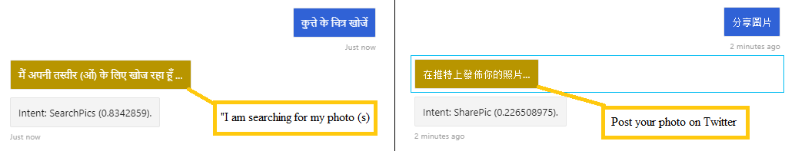

# Lab 8 - Language Detection and Translation in a Bot

The Language Detection feature of the Azure Text Analytics REST API evaluates text input for each document and returns language identifiers with a score that indicates the strength of the analysis.

The Language Detection feature can detect a wide range of languages, variants, dialects, and some regional or cultural languages. The exact list of languages for this feature isn't published.

In this hands-on you will create language detection feature and implement translation for the PictureBot.

## Prerequisites: 

1. This lab builds on [Lab 7](../Lab7-Integrate_LUIS/02-LUIS_Itegrate_Bot.md). If you not able to complete Lab 7 you can use completed solution from [code](../Lab7-Integrate_LUIS/code) folder.
2. The hands-on is also required Cosmos DB account set up [Lab 4](../Lab4-Log_Chat/02-Logging_Chat.md) and LUIS trained model [Lab 6](../Lab5-Implement_LUIS/02-Implement_LUIS.md).


## Lab 8.1 Create Microsoft Text Translator API.

To use the Translator Text API we need create a Translator Text Cognitive service and obtain subscription key and endpoint to connect.

This Subscription Key is needed to call Cognitive Services API’s to detect language and perform translation.

1. Login to [Azure portal](http://portal.azure.com)

1. On the menu on the Left, click **+ Create a resource**  

1. Type `Translator Text` and click **Create** button.

1. Provide unique service name and select S1 price tier.

1. Finlay hit **Create** button and wait until provisioning resource.

1. From the recourse blade select **Quick start** and copy the `Key1` and `Endpoint`. It will be used later in the code.

## Lab 8.2 Implement Language detection.

Open project PictureBot in your VS studio and located file `PictureBot.cs`

Locate function `OnMessageActivityAsync` triggers each time when the message arrives from user. Here is place when we will detect user language.

Locate the `UserProfile.cs` file. It should be in the folder `Models`. **UserProfile** class responsible for store data about user. In Lab 4 we collect user's  Utterance in the object and store in CosmosDB.

Add new field to `UserProfile` class. It is going to be a simple sting value with default value `en`:

```csharp
public string Language { get; set; } = "en"
```

Create new folder in the project named `Translator` and add files from [assets folder](../code/assets).

Lets spend some time to review the files. Open `Translator` class. This class will be used for language detection in function `Detect`.Detection process required only input text and return detected language.
`Translator` also implement function `Translate` which accept input text, input language and target language to translate. Output of the function is translated text in target language.

1. Open file `TranslatorAPIToken.cs`. This class is implementing authentication with Text Translator API in Azure. It is responsible to obtain token from token service, store and refresh token in cache.

Lets return back to `PictureBot.cs` and locate function `OnMessageActivityAsync`. This function should be modified to detect user's language by his messages. Lets add following lines after sore user Utterance in UtteranceList.

```csharp
     //detect user language
     userProfile.Language = _translator.Detect(turnContext.Activity.Text);
     MessageFactory.Text($"Detected language: {userProfile.Language}");
```

also you have to add following field in the top of the class.

```csharp
   private Translator _translator = new Translator();
```

Last thing to do before we do our first test is copy Keys and endpoint to `Translator.cs`. Update `CognitiveServicesTokenUri` and `SubscriptionKey` with values you copy from Translator Text on previous step.

Do not forget to update `appsettings.json` with your values from previous lab if you started from completed. Also you need update `LuisApplication` in `startup.cs` class.

Now your project should be build correctly. Lets run your bot now and test with some foreign language words:

- ciao  - should be detected as Italian.
- привет - should be detected as Russian.
- 你好 - should be detected as Chinese.
- नमस्ते - should be detected as Hindi.

Your testing responds should be as following:


>Notice that LUIS is able to detect simple greetings from foreign sentence. But unfortunately LUIS will not understand user's utterance because it was trained on English.

## Lab 8.3 Implement Language translation

On the next step we will implement language translation for incoming messages from users. Translation to English is required for LUIS service to understand utterance which is trained for. Lets implement user message translation.

We going to detect language above and translate message text and store translated in teh same Activity filed as source text for simplicity. Lets update function `OnMessageActivityAsync` to just store language in user's Profile. Replace following code

```csharp
     //detect user language
     userProfile.Language = _translator.Detect(turnContext.Activity.Text);
     MessageFactory.Text($"Detected language: {userProfile.Language}");
```

with

```csharp
     //detect user language
    userProfile.Language = _language;
```

Now locate `MainMenuAsync` function from `PictureBot.cs`. Add following code to the top of the function to make simple Regexp middleware and LUIS detect user intends:

```csharp
    //detect user language
    _language = _translator.Detect(stepContext.Context.Activity.Text);
    if (_language != "en")
    {
        string translated = _translator.Translate(stepContext.Context.Activity.Text, _language, "en");
        stepContext.Context.Activity.Text = translated;
    }
```

you also need to create new field for keep user language to properly respond him later. Add to the top of `PictureBot` class.

```csharp
  private string _language = "en";
 ```

We also need to update method  `GreetingAsync` which is used to greet user from his first message. Following code need to be placed right before `// Greet the user await MainResponses.ReplyWithGreeting(stepContext.Context);` call:

```csharp
     _language = _translator.Detect(stepContext.Context.Activity.Text);
    if (_language != "en")
    {
         string translated = _translator.Translate(stepContext.Context.Activity.Text, _language, "en");
         stepContext.Context.Activity.Text = translated;
    }
```

Now you can test some Lets run your bot now and test with utterance recognition:

- per favore ordina la mia foto  - should be detected as intent to make an order on Italian.
- добрый день - should be detected as greeting on Russian.
- 分享圖片 - should be recognized as intent of sharing pictures on Chinese.
- कुत्ते के चित्र खोजें - should be detected as intent to find dogs picture on Hindi.

Your testing responds should be as following:


>Notice that now LUIS and RegExp Middleware correctly detect user's intentions.

## Lab 8.4 Implement Language translation for bot response

In following task we will implement translation of bot messages back to the user in the language he made a requests. To implement translate functionality with minimum changes we will create delegate and pass the delegate to the MainResponse class.

Locate `PictureBot` class and add new field for delegate. We will use lambda function syntax.

```csharp
private Func<string,string> _translateDelegate;
```

Next we need to update `PictureBot` **constructor**. Somewhere before initialization logger add following line:

```csharp
_translateDelegate  = (output) => _translator.Translate(output, "en", _language);
```

Locate `MainResponses.cs` file and update all function with adding following parameter at the end. Used to be:

```csharp
 public static async Task ReplyWithGreeting(ITurnContext context)
```

should be, by adding a new parameter:

```csharp
 public static async Task ReplyWithGreeting(ITurnContext context, Func<string, string> translate)
 ```

 also each function should be modified with delegate call like `translate.Invoke`. Used to be:

```csharp
await context.SendActivityAsync($"Hi, I'm PictureBot!");
```

should be:

```csharp
await context.SendActivityAsync(translate.Invoke($"Hi, I'm PictureBot!"));
 ```

Complete replacement for all methods in class except `ReplyWithLuisScore` function, because it has a debug information.

Now return back in `PictureBot` class and update calls to `MainResponses` classes as following. Used to be:

```csharp
await MainResponses.ReplyWithShareConfirmation(stepContext.Context);
```

should be, by adding a new parameter:

```csharp
await MainResponses.ReplyWithShareConfirmation(stepContext.Context, _translateDelegate);
```

Implement the same changes in rest of the calls in `PictureBot` class.

If your project build successfully you can start testing. Run the bot and test again with following sentence and watch for respond. You can use [Bing translate](https://www.bing.com/search?q=bing+translator) to verify the response.

- per favore ordina la mia foto  - should be responded on Italian.
- добрый день - should be responded on Russian.
- 分享圖片 - should be recognized as intent of sharing pictures on Chinese.
- कुत्ते के चित्र खोजें - should be detected as intent to find dogs picture on Hindi.

Some of respond for translation listed below:




>Get stuck or broken? You can find the solution for the lab up until this point under [code/FinishedPictureBot-Part1](./code/FinishedPictureBot-Part1). You will need to insert the keys for your Azure Bot Service in the `appsettings.json` file. We recommend using this code as a reference, not as a solution to run, but if you choose to run it, be sure to add the necessary keys (in this section, there shouldn't be any).