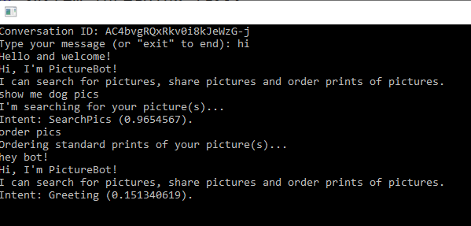
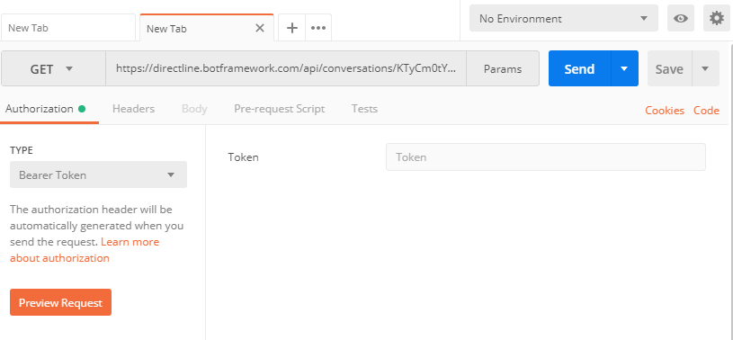
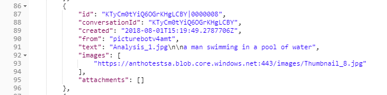

# Lab 9: Test Bots in DirectLine

## Lab 9.0: Prerequisites

This lab starts from the assumption that you have built and published the bot from [Lab 2](../Lab3-Basic_Filter_Bot/02-Basic_Filter_Bot.md). It is recommended that you do that lab in order to be successful in the ones that follow. If you have not, reading carefully through all the exercises and looking at some of the code or using it in your own applications may be sufficient, depending on your needs.

We'll also assume that you've completed [Lab 4](../Lab4-Log_Chat/02-Logging_Chat.md), but you should be able to complete the labs without completing the logging labs.

> Note: for these labs, we will be using the v4 of the Microsoft Bot Framework SDK. If you would like to perform similar labs with the v3 SDK, refer [here](./sdk_v3_labs).

### Publish bot

Before we going to the next exercise you need to publish your bot developed in previous hands-on. Please follow the instruction to publish your bot in Azure: 

1. You need to install latest version of the [Azure CLI](https://docs.microsoft.com/en-us/cli/azure/?view=azure-cli-latest).  

1. Open command line with folder where ".proj" file located.

1. Run command **az login** to set up context of Azure CLI console.

1. Run command to prepare your project **az bot prepare-deploy --lang Csharp --code-dir "." --proj-file-path "picturebot.csproj"**

1. Zip up the project's folder. Before zipping your project files, make sure that you are in the folder where ".proj" file located. Zip archive should not has any suborders and all files should be located in the root folder including folder like `bin` or `wwwroot`.

1. Run following command to upload the archive: **az webapp deployment source config-zip --resource-group "<new-group-name>" --name "<name-of-web-app>" --src "code.zip"**

1. Test your bot from Azure portal by select "Test in Web Chat" from the bot settings blade.

>If you have trouble with publishing please refer following [instruction](https://docs.microsoft.com/en-us/azure/bot-service/bot-builder-deploy-az-cli) but be aware you do not need to run template because you already have bot set up.

>Get stuck or broken? You can find the solution for the lab up until this point under [code/PictureBot](./code/PictureBot). You will need to insert the keys for your Azure Bot Service in the `appsettings.json` file. We recommend using this code as a reference, not as a solution to run, but if you choose to run it, be sure to add the necessary keys (in this section, there shouldn't be any).

### Collecting the Keys

Over the course of this lab, we will collect various keys. It is recommended that you save all of them in a text file, so you can easily access them throughout the workshop.

>_Keys_
>- Microsoft Bot Resource ID:
>- Microsoft Bot AppId:
>- Microsoft Bot AppPassword:
>- Direct Line Secret key:

## Lab 9.1 Connect directly to a bot

Communication directly with your bot may be required in some situations. For example, you may want to perform functional tests with a hosted bot. Communication between your bot and your own client application can be performed using the [Direct Line API](https://docs.microsoft.com/en-us/bot-framework/rest-api/bot-framework-rest-direct-line-3-0-concepts).

Additionally, sometimes you may want to use other channels or customize your bot further. In that case, you can use Direct Line to communicate with your custom bots.

Microsoft Bot Framework Direct Line bots are bots that can function with a custom client of your own design. Direct Line bots are similar to normal bots. They just don't need to use the provided channels. Direct Line clients can be written to be whatever you want them to be. You can write an Android client, an iOS client, or even a console-based client application.

This hands-on lab introduces key concepts related to Direct Line API.

## Lab 9.2: Setting up the Direct Line channel

In the portal, locate your published PictureBot and navigate to the "Channels" tab. Select the Direct Line icon (looks like a globe). You should see a "Default Site". Click "Show" and store one of  the secret keys in Notepad, or wherever you are keeping track of your keys. While you're in the portal, it's a good idea to also note the name of your bot, or "botId".

You can read detailed instructions on [enabling the Direct Line channel](https://docs.microsoft.com/en-us/azure/bot-service/bot-service-channel-connect-directline?view=azure-bot-service-4.0) and [secrets and tokens](https://docs.microsoft.com/en-us/azure/bot-service/rest-api/bot-framework-rest-direct-line-3-0-authentication?view=azure-bot-service-3.0#secrets-and-tokens).


## Lab 9.3: Create a console application

Open your published PictureBot solution in Visual Studio. We'll create a console application to help us understand how Direct Line can allow us to connect directly to a bot.

The console client application we will create operates in two threads. The primary thread accepts user input and sends messages to the bot. The secondary thread polls the bot once per second to retrieve any messages from the bot, then displays the messages received.

> Note: The instructions and code here have been modified from the [best practices in the documentation](https://docs.microsoft.com/en-us/azure/bot-service/bot-builder-howto-direct-line?view=azure-bot-service-4.0&tabs=cscreatebot%2Ccsclientapp%2Ccsrunclient).

**Step 1** - Create the console project

Right-click on the solution in Solution Explorer, then select **Add > New Project**. Create a new **Console App (.NET Framework)** titled `PictureBotDL` and based on .Net Framework 4.6, then select **OK**.

>Note: Project must be based on .NET Framework because of the packages connected on next step.

**Step 2** - Add NuGet packages to PictureBotDL

Right-click on the PictureBotDL project and select **Manage NuGet Packages**. Within the "Browse" tab (and with "include prerelease" checked), search and install/update:

- Microsoft.Bot.Connector.DirectLine
- Newtonsoft.Json
- Microsoft.Rest.ClientRuntime

**Step 3** Update Program.cs

Replace the contents of Program.cs (within PictureBotDL) with the following:

```csharp
using System;
using System.Diagnostics;
using System.Linq;
using System.Threading.Tasks;
using Microsoft.Bot.Connector.DirectLine;
using Newtonsoft.Json;

namespace PictureBotDL
{
    class Program
    {
        // ************
        // Replace the following values with your Direct Line secret and the name of your bot resource ID.
        //*************
        private static string directLineSecret = "YourDLSecret";
        private static string botId = "YourBotServiceName";

        // This gives a name to the bot user.
        private static string fromUser = "PictureBotSampleUser";

        static void Main(string[] args)
        {
            StartBotConversation().Wait();
        }


        /// <summary>
        /// Drives the user's conversation with the bot.
        /// </summary>
        /// <returns></returns>
        private static async Task StartBotConversation()
        {
            // Create a new Direct Line client.
            DirectLineClient client = new DirectLineClient(directLineSecret);

            // Start the conversation.
            var conversation = await client.Conversations.StartConversationAsync();

            // Start the bot message reader in a separate thread.
            new System.Threading.Thread(async () => await ReadBotMessagesAsync(client, conversation.ConversationId)).Start();

            // Prompt the user to start talking to the bot.
            Console.Write("Conversation ID: " + conversation.ConversationId + Environment.NewLine);
            Console.Write("Type your message (or \"exit\" to end): ");

            // Loop until the user chooses to exit this loop.
            while (true)
            {
                // Accept the input from the user.
                string input = Console.ReadLine().Trim();

                // Check to see if the user wants to exit.
                if (input.ToLower() == "exit")
                {
                    // Exit the app if the user requests it.
                    break;
                }
                else
                {
                    if (input.Length > 0)
                    {
                        // Create a message activity with the text the user entered.
                        Microsoft.Bot.Connector.DirectLine.Activity userMessage = new Microsoft.Bot.Connector.DirectLine.Activity
                        {
                            From = new ChannelAccount(fromUser),
                            Text = input,
                            Type = ActivityTypes.Message
                        };

                        // Send the message activity to the bot.
                        await client.Conversations.PostActivityAsync(conversation.ConversationId, userMessage);
                    }
                }
            }
        }


        /// <summary>
        /// Polls the bot continuously and retrieves messages sent by the bot to the client.
        /// </summary>
        /// <param name="client">The Direct Line client.</param>
        /// <param name="conversationId">The conversation ID.</param>
        /// <returns></returns>
        private static async Task ReadBotMessagesAsync(DirectLineClient client, string conversationId)
        {
            string watermark = null;

            // Poll the bot for replies once per second.
            while (true)
            {
                // Retrieve the activity set from the bot.
                var activitySet = await client.Conversations.GetActivitiesAsync(conversationId, watermark);
                watermark = activitySet?.Watermark;

                // Extract the activies sent from our bot.
                var activities = from x in activitySet.Activities
                                 where x.From.Id == botId
                                 select x;

                // Analyze each activity in the activity set.
                foreach (Microsoft.Bot.Connector.DirectLine.Activity activity in activities)
                {
                    // Display the text of the activity.
                    Console.WriteLine(activity.Text);

                    // Are there any attachments?
                    if (activity.Attachments != null)
                    {
                        // Extract each attachment from the activity.
                        foreach (Attachment attachment in activity.Attachments)
                        {
                            switch (attachment.ContentType)
                            {
                                // Display a hero card.
                                case "application/vnd.microsoft.card.hero":
                                    RenderHeroCard(attachment);
                                    break;

                                // Display the image in a browser.
                                case "image/png":
                                    Console.WriteLine($"Opening the requested image '{attachment.ContentUrl}'");
                                    Process.Start(attachment.ContentUrl);
                                    break;
                            }
                        }
                    }

                }

                // Wait for one second before polling the bot again.
                await Task.Delay(TimeSpan.FromSeconds(1)).ConfigureAwait(false);
            }
        }


        /// <summary>
        /// Displays the hero card on the console.
        /// </summary>
        /// <param name="attachment">The attachment that contains the hero card.</param>
        private static void RenderHeroCard(Attachment attachment)
        {
            const int Width = 70;
            // Function to center a string between asterisks.
            Func<string, string> contentLine = (content) => string.Format($"{{0, -{Width}}}", string.Format("{0," + ((Width + content.Length) / 2).ToString() + "}", content));

            // Extract the hero card data.
            var heroCard = JsonConvert.DeserializeObject<HeroCard>(attachment.Content.ToString());

            // Display the hero card.
            if (heroCard != null)
            {
                Console.WriteLine("/{0}", new string('*', Width + 1));
                Console.WriteLine("*{0}*", contentLine(heroCard.Title));
                Console.WriteLine("*{0}*", new string(' ', Width));
                Console.WriteLine("*{0}*", contentLine(heroCard.Text));
                Console.WriteLine("{0}/", new string('*', Width + 1));
            }
        }
    }
}
```

> Note: this code was slightly modified from [the documentation](https://docs.microsoft.com/en-us/azure/bot-service/bot-builder-howto-direct-line?view=azure-bot-service-4.0&tabs=cscreatebot%2Ccsclientapp%2Ccsrunclient#create-the-console-client-app) to include a few things we'll use in the next lab sections.

Don't forget to add your Direct Line information to the top!

Spend some time reviewing this sample code. It's a good exercise to make sure you understand how we're connecting to our PictureBot and getting responses.

**Step 4** - Run the app

Right-click on the PictureBotDL project and select "Set as Startup Project". Next, run the app and have a conversation with the bot.



>Get stuck or broken? You can find the solution for the lab up until this point under [code/PictureBotDL](./code/PictureBotDL). You will need to insert the keys for your Azure Bot Direct Line. 

Quick quiz - how are we displaying the Conversation ID? We'll see in the next sections why we might want this.

## Lab 9.4: Using HTTP Get to retrieve messages

Because we have the conversation ID, we can retrieve user and bot messages using HTTP Get. If you are familiar and experienced with Rest Clients, feel free to use your tool of choice.

In this lab, we will go through using Postman (a web-based client) to retrieve messages.

**Step 1** - Download Postman

[Download the native app for your platform](https://www.getpostman.com/apps). You may need to create a simple account.

**Step 2**

Using Direct Line API, a client can send messages to your bot by issuing HTTP Post requests. A client can receive messages from your bot either via WebSocket stream or by issuing HTTP GET requests. In this lab, we will explore HTTP Get option to receive messages.

We'll be making a GET request. We also need to make sure the header contains our header name (**Authorization**) and header value (**Bearer YourDirectLineSecret**). Additionally, we'll make the call to our existing conversation in the console app, by replacing {conversationId} with our current Conversation ID in our request: `https://directline.botframework.com/api/conversations/{conversationId}/messages`.

Postman makes this very easy for us to configure:
- Change the request to type "GET" using the drop down.
- Enter your request URL with your Conversation ID.
- Change the Authorization to type "Bearer Token" and enter your Direct Line Secret key in the "Token" box.



Finally, select send. Inspect your results. Create a new conversation with your console app and be sure to search for pictures. Create a new request using Postman. You will find the image url displayed within the images array.



### Going further

Have extra time? Can you leverage curl (download link: https://curl.haxx.se/download.html) from the terminal to retrieve conversations (like you did for Postman)?

> Hint: your command may look similar to `curl -H "Authorization:Bearer {SecretKey}" https://directline.botframework.com/api/conversations/{conversationId}/messages -XGET`
